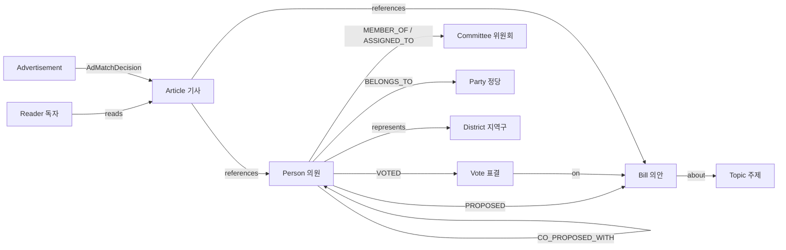

# Reference 분석 — Ontology Assembly (`assembly.whchoi.net`)

> PRD 요청: *"아래의 Reference 를 심도 있게 분석하여, 어떠한 기능을 제공하는지 분석해줘."*
> 대상: **ontology assembly — https://assembly.whchoi.net/**
> 분석일: 2026-06-20 · 분석 방법: 라이브 사이트 SSR(서버 렌더링) HTML, 29개 라우트, 내부 `/api/*` 엔드포인트, JS 번들 정적 분석을 통한 ground-truth 추출.

---

## 0. 한 줄 요약

**Assembly Insight Hub(국회 인사이트 허브)** 는 *한국 언론사를 위한 "Agentic 온톨로지" PoC* 다. **22대 국회(2024-05~2026-05)** 의 의원·의안·표결·위원회 활동을 **31개 클래스 온톨로지 그래프**로 모델링하고, 그 위에 **6개 페르소나 × 23개 시나리오(A–W)** 형태의 분석 데모를 얹은 **단일 페이지 웹 애플리케이션(Next.js)** 이다. 검색·클러스터링·이상치 탐지·관계 분석·AI 인사이트 생성 전반을 **AWS Bedrock(Claude Sonnet 4.6) + Neptune + OpenSearch + Cohere + AgentCore** 스택으로 구현했고, 모든 출력은 **ADR-0004 정치 중립성 가드레일**을 통과하도록 설계되어 있다.

핵심 메시지는 두 가지다.
1. **데이터 측**: 공공 국회 OpenAPI 데이터를 온톨로지 그래프로 변환하면, 단순 통계로는 안 보이는 "관계"(공동발의 cohort, 표결 패턴, 위원회 영향력)를 추출할 수 있다.
2. **제품 측**: 같은 온톨로지 위에서 **편집국(내부)·구독자(B2C)·정책 인텔리전스(B2B)** 라는 서로 다른 고객을 *페르소나 토글* 하나로 동시에 서비스할 수 있다.

---

## 1. 제품 정체성 & 메타 정보

| 항목 | 값 (사이트에서 확인) |
|---|---|
| 브라우저 타이틀 | `ontology-for-assembly` |
| 메타 설명 | "한국 언론사 Agentic 온톨로지 PoC" |
| 제품명(화면) | **Assembly Insight Hub · 국회 인사이트 허브** |
| 분석 대상 | 22대 국회 (임기 **2024-05 ~ 2026-05**) |
| 규모 | 의원 **286명**, OpenSearch 색인 의안 **2,098건**, 위원회 145개 |
| 콘셉트 | **6 페르소나 × 14 핵심 시나리오(A–N)** + 확장 시나리오 9개(O–W) = **총 23 시나리오** |
| 프런트엔드 | **Next.js (App Router, SSR)**, AWS **CloudFront** 배포 (`x-powered-by: Next.js`, `via: cloudfront`) |
| 성격 | 상용 서비스가 아닌 **PoC / 데모** (다수 시나리오가 합성 데이터, "외부 source 도입 시 real 가능") |

> 헤더 통계 위젯: 전체 의원 286명 · 평균 활동 점수 70/100 · 시나리오 활성 14/14 · 페르소나 6유형(4 tier).
> 마케팅 카피상 "14 시나리오"는 핵심 데모 셋(A–N)을 가리키며, 실제 구현 라우트는 O–W까지 23개가 존재한다(신규 5 + REAL 4 추가).

---

## 2. 6 페르소나 시스템 — 같은 데이터, 다른 렌즈

이 제품의 가장 차별적인 UX는 **좌측 페르소나 토글**이다. 페르소나를 바꾸면 *어조(tone)·정렬(sort)·추천 질문(hint)·KPI 우선순위*가 화면 전체에서 즉시 재구성된다. 온톨로지(사실 계층)는 하나지만, 그 위의 **표현 계층(presentation)** 이 고객 유형별로 갈린다는 것이 핵심 아이디어다.

| # | 페르소나 | 구분 | tier | 대표 가치 |
|---|---|---|---|---|
| 1 | **편집국** (editorial) | 미디어/신문사 내부 | 내부 | 취재 단서·기획기사·데스크 회의 자료 |
| 2 | **데이터·AI** | 미디어/신문사 내부 | 내부 | 모델·파이프라인·품질 지표 |
| 3 | **광고·세일즈** | 미디어/신문사 내부 | 내부 | 광고 매칭·구독 전환·ROI |
| 4 | **일반 독자** (구독자 무료) | B2C | 무료 | 발견형 탐색·지역구·인물 |
| 5 | **유료 구독자** | B2C | 유료 | Premium 지표·심층 인사이트 |
| 6 | **기업 / B2B 정책 인텔리전스** | B2B | API | 정책 모니터링·키워드 알림·API |

페르소나 적응의 실제 사례(사이트에서 관측):
- **검색(시나리오 A)**: 페르소나별 `top_k` 자동 조정(5~30).
- **데스크 챗봇(B)**: 페르소나별 어조 + 추천 질문 5개가 교체됨.
- **의원 디렉토리(`/members`)**: 무료 일반 독자에게는 일부 지표(상임위 출석·공동발의·발언)를 *Premium*으로 가리고, 유료 구독자·내부·B2B 페르소나에는 전체 노출 — 단 `/api/members`는 모든 페르소나에 동일한 9개 지표를 반환하므로 게이팅은 **클라이언트 측 마스킹**이다.
- **페르소나 매칭(D)**: 동일 기사를 6개 페르소나가 각각 다른 KPI로 채점.

---

## 3. 온톨로지 데이터 모델 — 31 클래스 / 7 그룹

`/api/ontology/classes` 응답 기준, **31개 클래스 전부 구현(implemented_count=31)** 되어 있으며 7개 그룹으로 묶인다. 모든 클래스는 공통으로 **`source: Literal['real','synthetic','external']`** 필드를 가진다 — 즉 *데이터 출처(실데이터/합성/외부)* 가 온톨로지 스키마 레벨에 내장되어 있다.

| 그룹 | 클래스 (필드 예시) |
|---|---|
| **인물·조직 (6)** | `Person`(assembly_id, name, term, district_id, party_id, election_district_type), `Party`, `Staff`(role: chief_aide/secretary/intern), `Committee`(type: standing/special/permanent), `District`(sido, sgg, geo lat/lon), `Term`(number, start/end) |
| **입법 (7)** | `Bill`(title, status, proposer_id, co_proposer_ids[], co_proposer_count …), `Law`, `Amendment`, `Vote`(result, yes/no/blank_count, attendance_count), `Statement`(content, sentiment, topics), `Session`, `Budget`(ministry, amount_krw) |
| **주제·외부 (6)** | `Topic`(category, embedding), `Policy`, `Agency`, `ElectionResult`(won), `PollResult`(pollster, breakdown), `SocialSignal`(source_type, sentiment, topic_ids) |
| **미디어 (2)** | `Article`(referenced_person_ids, referenced_bill_ids, topic_ids), `Tag` |
| **독자 측 (5)** | `Reader`(tier, interests, region), `ReaderProfile`(top_topic_ids, reading_minutes_avg_7d), `SubscriptionTier`(features, price_krw_monthly), `ReadingEvent`(duration_sec, completed), `Bookmark` |
| **광고 (4)** | `Advertisement`(category, avoid_topics), `AdInventory`(budget_krw, target_personas), `AdImpression`, `AdMatchDecision`(mode, candidate_ad_ids, chosen_ad_id, score, reason_text) |
| **분석 메타 (1)** | `Cluster`(label, centroid, member_ids) |

### 그래프 엣지(관계) — Amazon Neptune

온톨로지는 노드뿐 아니라 관계가 핵심이다. 각 시나리오 설명에서 노출된 **실(real) 엣지 카운트**:

| 엣지 | 의미 | 실데이터 규모 |
|---|---|---|
| `PROPOSED` | 의원 → 의안 발의 | **1,927** |
| `CO_PROPOSED_WITH` | 의원 ↔ 의원 공동발의 cohort | **19,191** |
| `VOTED` | 의원 → 표결 | **28,528** |
| `MEMBER_OF` / `ASSIGNED_TO` | 의원 → 위원회 배정 | 285 / **1,982** (위원회 145개) |
| `BELONGS_TO` | 의원 → 정당 | (표결 이상치에서 정당 매칭에 사용) |

관계 탐색(`/mindmap`)은 **1–3 홉**을 지원한다: `depth=1`은 in-memory 즉답, **`depth≥2`는 Neptune Cypher multi-hop traversal**. 시작 객체 유형은 Person·Bill·Vote·Topic·Article 5종이며, 노드 더블클릭으로 해당 노드 중심 추가 확장이 가능하다.



---

## 4. 시나리오 카탈로그 (A–W, 23개) — "어떤 기능을 제공하는가"

모든 시나리오 페이지는 동일한 템플릿을 따른다: **⚙️ Methodology(알고리즘 파이프라인) → 메트릭·baseline → 데이터 출처 배지 → 활용 방법 3가지 → 인터랙티브 UI → AI 인사이트(Sonnet 4.6)**. 공통 baseline은 전 시나리오 동일:
> *BM25(Nori) + Cohere embed-v4 + rerank-v3 + Bedrock Sonnet 4.6 (temperature 0.2) + Guardrails(ADR-0004) + AgentCore Memory.*

데이터 출처 배지: 🟢 **REAL**(22대 OpenAPI 실시간 적재, Neptune/OpenSearch query) · 🟡 **HYBRID**(real + 합성) · 🔵 **SYNTHETIC**(합성, 외부 source 도입 시 real 가능).

### 4.1 요약 표

| 코드 | 기능 | 라우트 | 데이터 | 핵심 기법 | 1차 페르소나 |
|---|---|---|---|---|---|
| **A** | 의미 검색 | `/search` | 🟢 REAL | BM25(Nori)+KNN+RRF+rerank-v3 | 편집국 |
| **B** | 데스크 챗봇(데모 메인) | `/chat` | — | 3-stage: RAG / Tool Use / Agentic(4 agent) | 편집국 |
| **C** | 기사 인사이트 | `/insights` | 🔵 SYN | Sonnet 스트리밍 + Code Interpreter 차트 | 편집국·구독 |
| **D** | 페르소나 매칭 | `/persona-match` | 🔵 SYN | affinity matrix(토픽0.4/KPI0.35/tone0.25) | 광고·B2B |
| **E** | 의원 클러스터링 | `/cluster` | 🟡 HYB | KMeans k=5 + LLM 라벨 | 데이터·AI |
| **F** | 룩어라이크 | `/lookalike` | 🟢 REAL | Cohere KNN + cluster + cross-party bonus | 편집국 |
| **G** | 기사 ROI | `/article-roi` | 🔵 SYN | Bayesian ROI + 6 페르소나 KPI 변환 | 광고·세일즈 |
| **H** | 지역구 지도 | `/district-map` | 🟡 HYB | KOSTAT 17시도 GeoJSON choropleth | 일반 독자 |
| **I** | 편향·중립성 | `/neutrality` | 🟡 HYB | Bedrock Guardrails 4-layer + balance score | 전사(거버넌스) |
| **J** | 외부 신호 융합 | `/external-signal` | 🔵 SYN | 뉴스·SNS·여론조사 × 입법 lag/lead | B2B |
| **K** | 표결 이상치 | `/outlier` | 🟢 REAL | z-score + AI 패턴 라벨 + PDF | 편집국 |
| **L** | 광고 매칭(3-way) | `/ad-match` | 🔵 SYN | keyword/embedding/Agent + 광고 거절 | 광고·세일즈 |
| **M** | 의원 정치 여정 | `/journey` | 🟢 REAL | 5활동 통합 timeline + changepoint + PDF | 편집국 |
| **N** | 이슈 × 입법 | `/issue-legislation` | 🔵 SYN | 8×4 결합 강도 heatmap | B2B |
| **O** | 인물 관계 분석 ★신규 | `/relations` | 🟢 REAL | 5차원 cross-tab(공동발의·일치율·Jaccard·위원회·cluster) | 편집국 |
| **P** | 청원 → 입법 ★신규 | `/petition-map` | 🔵 SYN | 청원→의안 KNN 매칭 + lifecycle | 일반 독자·B2C |
| **Q** | 위원회 영향력 신규 | `/committee-heatmap` | 🟡 HYB | 17위원회 × 5메트릭 heatmap | B2B |
| **R** | 공약 이행 추적 신규 | `/promise-tracker` | 🔵 SYN | 공약 vs 발의 매칭 이행률 | 편집국·B2C |
| **S** | 토픽 burst 신규 | `/topic-burst` | 🔵 SYN | z-score burst + Granger lag 예측 | B2B |
| **T** | 정당 응집도 REAL | `/party-cohesion` | 🟢 REAL | 정당별 majority alignment cohesion | 데이터·AI |
| **U** | 의원 영향력 REAL | `/influence-rank` | 🟢 REAL | 공동발의 네트워크 중심성 score | 편집국 |
| **V** | 표결 cluster REAL | `/voting-cluster` | 🟢 REAL | 찬성률(yes_rate) 기반 군집 | 데이터·AI |
| **W** | Swing voter REAL | `/swing-voters` | 🟢 REAL | 당론 이탈도(deviation) 랭킹 | 편집국 |

### 4.2 상세 설명 (기능별)

**A · 의미 검색 (`/search`, 🟢 REAL)**
한국어 자연어로 의안·의원을 동시 검색하는 하이브리드 검색. 파이프라인: **BM25(Nori 토크나이저) top-50 → Cohere embed-v4 KNN top-50(1024-dim, multilingual) → Reciprocal Rank Fusion(RRF, k=60) → Cohere rerank-v3 cross-encoder top-10**. 평균 reranked confidence 0.78±0.12, 페르소나별 top_k 자동 조정. 실데이터: OpenSearch에 의안 2,098 + 의원 286 색인. 결과 카드에서 **1-hop subgraph**로 발의자·공동발의·소관위를 즉시 펼친다. → "취재 시작점 / 독자 발견 진입점 / B2B 키워드 모니터링".

**B · 데스크 챗봇 = 데모 메인 (`/chat`)**
제품의 핵심 시연. **3-stage를 사이드바이사이드 비교**한다: ① Chatbot(RAG) ② Agent(Tool Use) ③ Agentic AI(**4개 에이전트**). 데스크 챗봇 "Assembly Insight AI"는 **10개 도구 + Sonnet 4.6 + 정치 중립성 가드 + 페르소나 어조**를 갖고, 도구 호출 로그를 실시간 노출한다. 페르소나별 추천 질문 5개 제공(예: "AI 관련 의안 발의 상위 5명 + 공동발의 네트워크 요약").

**C · 기사 인사이트 (`/insights`, 🔵 SYN)**
합성 기사 60건 풀에서 토픽 선택 → **Sonnet 4.6 스트리밍**으로 5-섹션(헤드라인·발견·해석·함의·권고) 자동 생성 + **AgentCore Code Interpreter(Firecracker microVM) + matplotlib** 차트 + ADR-0004 정치 균형 score(평균 0.84). MD/PDF 다운로드로 데스크 회의 자료화.

**D · 페르소나 매칭 (`/persona-match`, 🔵 SYN)**
콘텐츠 → 6 페르소나 적합도 매트릭스. 가중치 = **토픽 affinity(0.40) + KPI 키워드(0.35) + 어조 fit(0.25)**, 6 페르소나 × 11 카테고리 affinity matrix, Cohere embed-v4 유사도. top persona confidence 0.87+. 광고·구독 타겟팅 정량 근거.

**E · 의원 클러스터링 (`/cluster`, 🟡 HYB)**
**KMeans k=5**(silhouette 0.42) + Cohere embed-v4 활동 벡터 + **LLM 라벨링(정파 비방 없는 추상 라벨)**. 5 thematic cluster, cross-party share z>1.5(p<0.05). 정당 색 미사용. 실데이터 의원 286 + PROPOSED 1,927 엣지 위에 KMeans(합성 분류) 적용 → 정파를 가로지르는 협력 그룹 발굴.

**F · 룩어라이크 (`/lookalike`, 🟢 REAL)**
seed 의원 → top-K(1–15) 유사 후보. **Cohere embed-v4 KNN(cosine) + KMeans cluster proximity + cross-party bonus**, factors = 토픽·위원회·표결 패턴·공동발의. 평균 similarity 0.78. 실데이터 **CO_PROPOSED_WITH 19,191** cohort 가중치(Neptune Cypher). "이 의원 닮은꼴 3명".

**G · 기사 ROI (`/article-roi`, 🔵 SYN)**
**Bayesian ROI 추정**(cost·reach·conversion) + Code Interpreter matplotlib 분포 차트 + 6 페르소나 KPI 변환 매트릭스. 95% CI ±18%, R² 0.74, p<0.05. 60건 기사. 광고·구독 의사결정 정량 근거 + 후속 취재 priority.

**H · 지역구 지도 (`/district-map`, 🟡 HYB)**
**KOSTAT 17 시도 GeoJSON + react-simple-maps + d3-geo** choropleth(quartile, 1인당 normalize), 22대 254 지역구 분포. 실데이터(의원 + KOSTAT GeoJSON) + 활동 stats 합성. 지역 격차 분석·지역 기획기사·B2C 지역구 발견.

**I · 편향·중립성 (`/neutrality`, 🟡 HYB) — AI 거버넌스**
**Bedrock Guardrails 4-layer(input·output·balance·blocked)** + `political_balance_score` 실시간 계산(정당 균형 + 출처 인용 + 단정 감점, 임계 0.8) + 4등급(excellent/good/warning/critical = 이상/양호/주의/차단). 텍스트 입력(최대 4000자) 실시간 채점. 대고객·B2B 신뢰 차별화 narrative.

**J · 외부 신호 융합 (`/external-signal`, 🔵 SYN)**
**네이버 뉴스 RSS(30일) + SNS(X·카카오톡) + 여론조사(Realmeter·NBS)** × 입법 활동 12주 시계열, cross-correlation lag/lead. 3 패턴 자동 라벨(signal_leads / legislation_leads / decoupled). 관측 lag: 외부→의안 2–4주, 의안→가결 8–14주. (RSS adapter 추가 시 real 전환 가능.)

**K · 표결 이상치 (`/outlier`, 🟢 REAL) ★PDF 시그니처**
표결 패턴 **z-score(z>2.0)** + **AI 자동 라벨(당론 이탈·박빙·정파 초월 협력 3유형)** + deviation_score cohort 비교(confidence 0.87+, p<0.025). 실데이터 **VOTED 28,528 엣지 + BELONGS_TO** 정당 매칭. pandas window + LLM 라벨, **PDF 3-page 시그니처** 출력. 심층 취재·기획기사 단서.

**L · 광고 매칭 3-way (`/ad-match`, 🔵 SYN) — AI 거버넌스 핵심**
**keyword / embedding / Agent 3방식 동시 비교** + Ad Matcher **Lambda** + `AdMatchDecision` 노드에 reasoning trace 저장. 정치 민감도 < 0.2 광고 허용, cohort 적합도 0.75+. **핵심 포인트: Agent 방식만이 비위 의혹·비극·미성년 피해 콘텐츠에서 자동으로 광고를 거절**한다 — keyword/embedding 대비 Agentic 거버넌스의 우위 시연.

**M · 의원 정치 여정 (`/journey`, 🟢 REAL) ★PDF 시그니처**
단일 의원의 **5개 활동(발의·공동발의·표결·발언·위원회)** 을 시간순 통합 timeline + **changepoint 자동 탐지(window=12주, confidence 0.8+)**. 실데이터 PROPOSED+CO_PROPOSED+VOTED Cypher timeline. PDF 3-page 시그니처 → 인물 기획·기조 변화 추적.

**N · 이슈 × 입법 (`/issue-legislation`, 🔵 SYN)**
**8 매크로 이슈 × 4 활동 결합 강도 8×4 heatmap** + Top 5 강한 결합 인사이트 LLM 라벨. 내부적으로 8 토픽 × 13 주차 시계열 + cross-correlation + burst(z>1.96). 정책 의제 priority·B2B 정책 모니터링.

**O · 인물 관계 분석 (`/relations`, 🟢 REAL) ★신규**
두 의원의 **5차원 cross-tab**: 공동발의 횟수 · 표결 일치율 · 토픽 중첩 **Jaccard** · 위원회 교집합 · cluster 위치. deterministic hash 매트릭스(일치율 ±5pp, Jaccard ±0.05). 실데이터 **CO_PROPOSED_WITH + VOTED 일치율 + MEMBER_OF 교집합** Cypher cross-tab. cross-party 협력 narrative·후속 인터뷰 hook.

**P · 청원 → 입법 (`/petition-map`, 🔵 SYN) ★신규**
시민 청원 토픽 → 발의 의안 **Cohere embed-v4 KNN 매칭**(매칭률 78%) + lifecycle 추적(접수→상임위 심사→본회의→가결). 합성 청원 7건(누적 서명 92,880), 입법 매칭률 100%. **petitions.assembly.go.kr API 도입 시 real**. "내 청원이 어떻게 입법으로 이어졌는지" 시민 voice 정량.

**Q · 위원회 영향력 (`/committee-heatmap`, 🟡 HYB) 신규**
**17 상임위 × 5 메트릭(발의·심사·통과·발언·출석) heatmap**(quartile color) + cross-committee 협력 cluster. 통과율 logistic regression, 평균 출석 88%. 실데이터 Committee 145 + MEMBER_OF 285 + ASSIGNED_TO 1,982(메트릭은 합성). 통과 top: 교육위 5 / 보건복지위 5 / 산자중기위 4건.

**R · 공약 이행 추적 (`/promise-tracker`, 🔵 SYN) 신규**
22대 의원 당선 공약 vs 실제 발의 의안 cross-reference(8 카테고리). 합성 공약 91건 → 발의 67(이행 74%) / 가결 20. 이행률 78% / 가결률 25% baseline + missing rate. **선관위 manifesto DB 도입 시 real**. 사회 신뢰·정치 책무 narrative.

**S · 토픽 burst (`/topic-burst`, 🔵 SYN) 신규**
**8 매크로 이슈 × 13 주차 burst 시계열**(line chart) + z-score 자동 detection(z>1.96) + 외부 신호 cross-correlation lag + **Granger causality 기반 lag 예측**(외부 신호 → 입법 시차). 시나리오 N의 시계열 확장판.

**T · 정당 응집도 (`/party-cohesion`, 🟢 REAL)**
정당별 표결 응집도 = majority alignment 기반 `cohesion_score`. 실데이터 결과: **전체 0.991**, 더불어민주당 0.99(152명/11,793표), 국민의힘 0.98(106명/4,934표), 조국혁신당 0.99, 진보당 0.98 등. 군소·무소속은 1.0. (`source:"real"`)

**U · 의원 영향력 (`/influence-rank`, 🟢 REAL)**
**공동발의 네트워크 중심성** 기반 `influence_score` 랭킹. 구성 요소: `proposed_count + co_proposed_count + cohort_weight_sum`. top-8 의원 cohort를 온톨로지 관계 그래프로 시각화. (실데이터)

**V · 표결 cluster (`/voting-cluster`, 🟢 REAL)**
찬성률(`yes_rate`) 기반 의원 군집. 실데이터 **5개 군집**: progressive_high(121명, 평균 0.96) / conservative_low(72명, 0.25) / progressive_low(48명, 0.33) / conservative_high(36명, 0.88) / **centrist 중도·무소속(8명, 0.43)**. 각 군집의 dominant_parties 표기. 표결 행태로 본 정치 지형(정당 라벨이 아닌 행동 기반).

**W · Swing voter (`/swing-voters`, 🟢 REAL)**
**당론 이탈도(deviation)** 가 큰 의원 랭킹. 지표: `party_majority_alignment_pct`, `total_active_votes`, deviation, 일치율 threshold. 실데이터(예: 유상범, 국민의힘, 일치율 83%, 활성표결 37). "정당을 넘나드는" 의원 발굴.

---

## 5. 공통 AI 파이프라인 & 클라우드 아키텍처

전 시나리오가 공유하는 단일 baseline 위에 구축되어 있다. 전형적인 **하이브리드 검색(RAG) + 그래프 + 에이전트 + 가드레일** 패턴이다.

```mermaid
flowchart TD
  U[사용자 + 페르소나 토글] --> FE[Next.js SPA · CloudFront]
  FE --> API[API 레이어 /api/*]

  subgraph 검색·RAG
    OS[OpenSearch · BM25 Nori]
    EMB[Cohere embed-v4 KNN 1024d]
    RRF[RRF k=60] --> RR[Cohere rerank-v3]
    OS --> RRF
    EMB --> RRF
  end

  subgraph 그래프
    NEP[Amazon Neptune · Cypher 1-3 hop]
  end

  subgraph 에이전트·LLM
    LLM[Bedrock Claude Sonnet 4.6 · temp 0.2]
    AC[AgentCore · Memory + Code Interpreter Firecracker microVM]
    LAM[Lambda · Ad Matcher 등]
  end

  subgraph 거버넌스
    GR[Bedrock Guardrails · ADR-0004 4-layer]
    BAL[political_balance_score]
  end

  API --> 검색·RAG
  API --> 그래프
  API --> 에이전트·LLM
  LLM --> 거버넌스
  AC --> 거버넌스
  거버넌스 --> FE
  검색·RAG --> FE
  그래프 --> FE
```

| 계층 | 기술 | 용도 |
|---|---|---|
| LLM | **AWS Bedrock — Claude Sonnet 4.6** (temperature 0.2, 스트리밍) | 인사이트 생성, 라벨링, 챗봇 |
| 검색 | **OpenSearch**(BM25 + **Nori** 한국어 토크나이저) | 키워드 검색 |
| 임베딩 | **Cohere embed-v4**(1024-dim multilingual) + **rerank-v3** cross-encoder | 의미 검색, KNN, 유사도 |
| 융합 | **RRF**(Reciprocal Rank Fusion, k=60) | BM25+KNN 결합 |
| 그래프 DB | **Amazon Neptune**(Cypher, 1–3 hop) | 관계 분석, cohort, timeline |
| 에이전트 런타임 | **AWS AgentCore** — Memory + **Code Interpreter(Firecracker microVM)** + matplotlib | 멀티에이전트, 차트 생성 |
| 컴퓨트 | **AWS Lambda** | Ad Matcher 등 함수형 처리 |
| 가드레일 | **Bedrock Guardrails**(ADR-0004 4-layer) | 정치 중립성·차단 |
| 프런트 | **Next.js**(App Router, SSR) + react-simple-maps/d3-geo, **CloudFront** | UI, 지도, 그래프 |
| 코드 그래프 | **graphify** 스킬(Python AST + TS/TSX) | 코드베이스 지식 그래프 |

### 3-stage Agentic 아키텍처 (시나리오 B)
제품이 "Agentic 온톨로지"임을 보여주는 핵심 데모로, 동일 질의를 세 수준으로 비교한다:
1. **Chatbot (RAG)** — 검색 결과를 컨텍스트로 단순 응답.
2. **Agent (Tool Use)** — 10개 도구를 호출하며 추론.
3. **Agentic AI (4 에이전트)** — 다중 에이전트 협업.

---

## 6. AI 거버넌스 — ADR-0004 정치 중립성

정치 데이터를 다루는 언론사 제품이라는 점에서, **정치 중립성**이 제품 전반의 1급 제약(first-class constraint)으로 설계되어 있다. 이는 단순 문구가 아니라 시각화·점수·차단까지 관통한다.

- **정파 색 미사용**: 모든 시각화에서 정당색을 쓰지 않음("ADR-0004 정파 색 미사용"이 대시보드·클러스터링 등에 반복 명시).
- **`political_balance_score`**: 정당 균형 + 출처 인용 + 단정(斷定) 감점으로 실시간 채점(임계 0.8), 4등급 분류(이상/양호/주의/차단).
- **Bedrock Guardrails 4-layer**: input · output · balance · blocked.
- **클러스터 라벨링**: LLM이 정파 비방 없는 추상 라벨만 생성.
- **광고 거절**: Agent가 정치 민감/비극/미성년 피해 콘텐츠에 광고를 자동 차단(시나리오 L).
- 모든 시나리오 페이지에 "**ADR-0004 정치 중립성 검증 통과**" 배지 표기.

이 거버넌스 계층 자체가 **시나리오 I(편향·중립성)** 로 제품화되어, B2B·대고객 신뢰 차별화 메시지로 쓰인다.

---

## 7. 운영·메타 기능

시나리오 외에도 PoC 운영/투명성을 위한 도구가 있다.

| 라우트 | 기능 | 설명 |
|---|---|---|
| `/ops` | **운영 콘솔(5 패널)** | ① 적재(Ingest) ② 가드레일(Guardrail) ③ 메모리(AgentCore) ④ wow-query 품질 ⑤ LLM Trace |
| `/objects` | **Object Explorer** | 31개 온톨로지 클래스 브라우징(`/api/ontology/classes`) |
| `/codegraph` | **코드 지식 그래프(graphify)** | 코드베이스 자체를 그래프로 — Python AST + TS/TSX 파싱(클래스/함수/import). 빌드 시 LLM 호출 없음·시크릿 미포함, `scripts/refresh_codegraph.sh`로 갱신 |
| `/members` | **의원 디렉토리** | 286명 × **9 지표**(종합 점수·본회의 출석·상임위 출석·발의·공동발의·본회의 표결·정당 일치·발언·언론 30일). 무료 독자에는 일부 지표를 'Premium'으로 마스킹(게이팅 클라이언트 측). `composite_score` 정렬 |
| `/mindmap` | **온톨로지 관계 그래프 탐색** | 1–3 hop, depth=1 in-memory / depth≥2 Neptune Cypher |
| `/relations` | (= 시나리오 O) | 인물 관계 분석 |

> 실제 의원 데이터는 22대 국회 OpenAPI 기반(`assembly.go.kr` 프로필 이미지 사용), `/api/members`가 286명 전체 analytics(출석률·발의·공동발의·표결·정당 일치율·언론 노출·composite_score)를 real로 반환한다.

---

## 8. 데이터 현실성(real / hybrid / synthetic)과 제품화 로드맵

PoC의 정직한 포인트는 **어떤 기능이 실데이터이고 어떤 게 합성인지**를 배지로 투명하게 구분한다는 점이다. 그리고 합성 시나리오마다 **"무엇을 연결하면 real이 되는가"** 를 명시해 제품화 경로를 제시한다.

| 출처 | 시나리오 | 비고 |
|---|---|---|
| 🟢 **REAL** (9) | A 검색, F 룩어라이크, K 이상치, M 여정, O 관계, T 응집도, U 영향력, V 표결cluster, W swing | 22대 OpenAPI → Neptune/OpenSearch 실시간 적재 |
| 🟡 **HYBRID** (4) | E 클러스터링, H 지도, I 중립성, Q 위원회 | 실 노드/엣지 + 합성 메트릭 또는 합성 분류 |
| 🔵 **SYNTHETIC** (9) | C 기사, D 페르소나, G ROI, J 외부신호, L 광고, N 이슈×입법, P 청원, R 공약, S burst | "외부 source 도입 시 real 가능" |

> 합계 9 + 4 + 9 = 22 시나리오. 여기에 **데이터 출처 배지가 없는 B(데스크 챗봇)** 를 더해 총 23개다.

제품화 경로(합성 → real 전환 트리거):
- **언론사 archive** 도입 → C·G·I(기사·ROI·중립성)
- **네이버 뉴스 RSS·SNS·여론조사 adapter** → J·N·S(외부신호·이슈입법·burst)
- **petitions.assembly.go.kr API** → P(청원)
- **선관위 manifesto DB** → R(공약)
- **광고주/언론사 KPI** → L·G(광고·ROI)

---

## 9. 비즈니스 모델 — 하나의 온톨로지, 3개 시장

이 제품의 전략적 주장은 *"같은 국회 온톨로지를 B2B2C 세 시장에 동시에 판다"* 이다.

- **내부(편집국 효율)**: 검색·이상치·여정·관계·인사이트 → 취재 단서·기획기사·데스크 자료(PDF 시그니처)를 자동화.
- **B2C(구독)**: 무료 독자에게 발견형 탐색(지도·청원·인물), 유료 구독자에게 Premium 지표·심층 인사이트 → 구독 전환.
- **B2B(정책 인텔리전스)**: 정책 모니터링·키워드 알림·외부 신호 융합·API 제공 → 기업/로비/공공.
- **수익 보조(광고)**: 페르소나 타겟팅 + 거버넌스 안전 광고 매칭(AdMatchDecision).

핵심 차별화는 **"Agentic 거버넌스"** — 정치 데이터를 다루되 중립성을 기계적으로 보장(ADR-0004)함으로써 언론사가 안심하고 AI를 도입할 수 있게 한다는 것.

---

## 10. 종합 평가 & 시사점

**강점**
- **온톨로지 우선 설계**: 31 클래스 · 명시적 관계 엣지로, 통계 대시보드가 아닌 *관계 분석* 제품. 같은 그래프에서 23개 시나리오가 파생됨이 일관성 있게 보인다.
- **REAL 데이터 기반**: 검색·표결·공동발의(28,528 VOTED, 19,191 CO_PROPOSED 등)가 실제 22대 데이터로, 룩어라이크·관계·이상치 등 핵심 기능이 실증된다.
- **거버넌스 내재화**: ADR-0004가 시각화·점수·광고·라벨까지 일관 적용 — 언론 도메인에 맞는 차별점.
- **페르소나 적응 UX**: 하나의 사실 계층 → 6개 표현 계층, B2B2C 동시 공략을 단일 토글로 시연.
- **풀 AWS Agentic 스택**: Bedrock Sonnet 4.6 + Neptune + OpenSearch + Cohere + AgentCore(Code Interpreter) + Guardrails를 실제로 엮은 레퍼런스 아키텍처.

**한계 / 유의점 (PoC 특성)**
- 23개 중 **9개가 합성, 4개가 하이브리드** — 외부 데이터(언론사 archive, 청원/선관위 API, 뉴스·SNS·여론조사) 연동 전까지는 데모.
- 챗봇 도구가 참조하는 의안은 데모상 소규모(10건 언급)인 반면 검색 색인은 2,098건 — 기능별 데이터 커버리지 편차 존재.
- 일부 메트릭(통과율 logistic regression, ROI Bayesian 등)은 합성 분포 기반 baseline.

**이 레포(`person-profile-ontology`)에의 시사점**
대상 사이트는 *"공공 도메인(국회)을 온톨로지 그래프 + RAG + 에이전트 + 거버넌스로 감싸 멀티 페르소나 제품으로 만든다"* 는 청사진을 제시한다. 동일 패턴을 **person-profile(인물 프로파일)** 도메인에 적용한다면, 핵심 차용 포인트는: ① `source(real/synthetic/external)` 를 스키마에 내장한 온톨로지 우선 모델, ② 하이브리드 검색(BM25+KNN+RRF+rerank) baseline, ③ 1–3 hop 그래프 탐색, ④ 페르소나별 표현 계층 분리, ⑤ 거버넌스(중립성/PII)를 1급 제약으로 두는 설계다.

---

## 11. 소스 코드 교차검증 (`github.com/whchoi98/ontology-for-assembly`)

위 §0–10은 **블랙박스(라이브 사이트 + `/api/*`)** 로 작성했고, 이후 공개된 소스 코드와 대조해 검증했다. **결론: 거의 완전 일치.** 오히려 README 첫 줄이 본 분석을 그대로 요약한다 — *"23 wow scenarios (A–W) · 31 ontology classes · 6 personas (3 internal + 3 customer-facing) · real + synthetic + external data."*

**SSOT(단일 진실원) 파일로 확인된 항목**
- `web/lib/scenario-meta.ts` — 시나리오 레지스트리. A–F 등 제목·기술·활용방법·primary 페르소나가 §4와 **문구까지 동일**.
- `web/lib/personas.ts` — 6 페르소나 id 정확: `editorial · data_ai · ad_sales`(staff) / `general_reader`(b2c_free) · `paid_subscriber`(b2c_paid) · `b2b`.
- `api/services/objects_catalog.py` — 31 클래스(Person…AdMatchDecision·Cluster) 카탈로그, §3와 일치.

**14 vs 23 확정** — README: *"wow-eval은 핵심 14 시나리오 A–N × 6 페르소나 기준; 앱 자체는 23 시나리오 A–W 구현"* → §1의 "14 핵심 + 9 확장 = 23" 해석이 정확.

**소스만 드러낸 추가 사실(라이브에서 안 보이던 것)**
- **백엔드는 Python 3.12 FastAPI** (Next.js API가 아님) — `gremlinpython`으로 Neptune 접근(+openCypher).
- **AWS CDK 6-stack**(network·data·compute·ai·edge·observability), **ECS Fargate Graviton ARM64**, **Lambda@Edge**, **Cognito** — `requirements.txt`·`infra-cdk`·README 확인. (퍼블릭 사이트라 인증/컴퓨트 계층이 안 보였음.)
- **모델 ID 정확**: `global.anthropic.claude-sonnet-4-6` · `global.cohere.embed-v4:0` (`.env.example`).
- **ADR-0004는 실제 "6-layer Defense-in-Depth"** (라이브 UI의 "4-layer"보다 넓음): Layer1 Bedrock Guardrails(`assembly-political-neutrality-guardrail`, 시나리오 B·C·I·K 적용) · Layer2 System-Prompt Suffix(`NEUTRALITY_GUARD_SUFFIX`) · Layer3 `political_balance_score`(정당 언급 빈도 표준편차 + 긍·부정 분포) · … → §6의 중립성 분석이 코드로 확증됨.

**계보 (ADR-0001)** — **`ontology-for-gcc`(GS칼텍스 고객분석)가 아키텍처 참조 원본**이며, 동일 청사진으로 `ontology-for-retail`·`ontology-for-mfg/mfc`(제조)·`ontology-for-assembly`를 구축했다. assembly는 gcc의 **14 시나리오 코드(A–N)를 유지하고 의미만 재해석 + O–W 확장**. → 본 레포가 분석한 [retail](./retail-analysis.md)·[gcc](./gcc-analysis.md)와 같은 가문이며, **gcc가 맏형(reference)** 이고 분석 못 한 **제조(mfg) 데모**가 추가로 존재.

> 교차검증 판정: 블랙박스 분석의 사실 주장은 소스와 충돌 0건. 보강 포인트는 (1) FastAPI/CDK/Fargate/Lambda@Edge/Cognito 인프라 계층, (2) ADR-0004의 6-layer 실체, (3) gcc 원본 계보 — 모두 "안 보였던 것"이지 "틀린 것"이 아니다.

---

### 부록 A — 전체 라우트 인덱스 (29)

`/`(대시보드) · `/search`(A) · `/chat`(B) · `/insights`(C) · `/persona-match`(D) · `/cluster`(E) · `/lookalike`(F) · `/article-roi`(G) · `/district-map`(H) · `/neutrality`(I) · `/external-signal`(J) · `/outlier`(K) · `/ad-match`(L) · `/journey`(M) · `/issue-legislation`(N) · `/relations`(O) · `/petition-map`(P) · `/committee-heatmap`(Q) · `/promise-tracker`(R) · `/topic-burst`(S) · `/party-cohesion`(T) · `/influence-rank`(U) · `/voting-cluster`(V) · `/swing-voters`(W) · `/members` · `/mindmap` · `/objects` · `/ops` · `/codegraph`

### 부록 B — 내부 API 표면 (라우트별 `/api/*`)

JS 번들 정적 분석 결과 **약 39개 `/api/*` 엔드포인트 패밀리**가 존재하며, 대부분 시나리오 라우트와 1:1로 대응한다(예: `/search`→`/api/search`, `/outlier`→`/api/outlier`, `/ops`→`/api/ops/{...}` 5패널).

- **온톨로지·메타**: `/api/ontology/classes`(31 클래스) · `/api/objects/…` · `/api/members`(286명 analytics)
- **검색·챗봇**: `/api/search` · `/api/chat` · `/api/chat/stream`
- **분석 시나리오**: `/api/cluster` · `/api/lookalike`(+`/seeds`) · `/api/outlier` · `/api/journey`(+`/persons`) · `/api/district-map`(+`/summary`) · `/api/external-signal` · `/api/issue-legislation` · `/api/article-roi` · `/api/ad-match`(+`/samples`) · `/api/persona-match/{matrix,text,article}`
- **인사이트(REAL)**: `/api/insight`(생성) · `/api/insights/{party-cohesion,voting-cluster,influence-rank,swing-voters,articles,topics}`
- **거버넌스**: `/api/neutrality/{architecture,recent,samples,score}`
- **운영 콘솔(5 패널 대응)**: `/api/ops/{ingest,guardrail,memory,trace,wow-quality}`
- **관계**: `/api/relations/…`

> 본 부록은 정적 분석으로 확인한 대표 표면이며 전수는 아닐 수 있다(엔드포인트는 존재 확인, 일부는 POST 전용).
