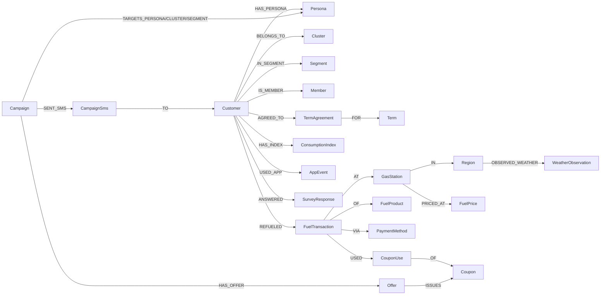

# Reference 분석 ③ — Ontology GCC (`gcc.whchoi.net`)

> 요청: *"analyze https://gcc.whchoi.net/"* — [assembly](./analysis.md)·[retail](./retail-analysis.md) 분석과 동일한 방식.
> 대상: **Ontology GCC — GS Caltex M&M본부 데모 (v1.0.63)** · https://gcc.whchoi.net/ (공개)
> 분석일: 2026-06-20 · 방법: SSR HTML 48개 라우트 + 내부 `/api/ontology/schema`·`standards`·`validation` + `/api/objects/*` ground-truth 추출.

---

## 0. 한 줄 요약

**Ontology GCC** 는 **GS Caltex 마케팅·멤버십(M&M)본부** 를 위한 *"고객·캠페인·주유 데이터를 온톨로지 + Agentic AI 로 풀어내는"* 정유 리테일 PoC다. **Opinet(유가) · KOSTAT(행정구역) · KFDA(유해성) · KMA(기상) · 현대카드(소비지수)** 표준/외부 시그널을 결합한 데이터를 **Amazon Neptune** 그래프(**25 클래스 / 31 관계**, 약 **2.1M+ 노드**)에 적재하고, 그 위에 **14개 시나리오(A 하이브리드 검색 → N 날씨×주유)** 와 **25종 Knowledge Graph 객체 탐색**, **5개 부서 페르소나** 전환을 한 화면에 제공한다.

[assembly](./analysis.md)·[retail](./retail-analysis.md) 데모와 **같은 팀·같은 스택(Bedrock Sonnet 4.6 + Neptune + OpenSearch + AgentCore + graphify + Next.js)** 의 세 번째 도메인 이식이며, 세 데모 중 **가장 성숙(v1.0.63)** 하고 **데이터 규모가 가장 크다**(주유 거래 55만 건·가격 시계열 127만 건). 특징적 차별점:
1. **부서 페르소나**: 6 고정(국회) / 45 합성 쇼퍼(리테일) → **5개 사내 부서**(마케팅·고객전략·데이터·AI·CRM·회원사업·리테일영업).
2. **데이터 출처 계층**을 스키마에 내장: `Customer.data_depth ∈ {deep-history, coupon-only, sales-only, lookalike-syn}` — 실 코호트 500명 + 50K 합성 룩어라이크의 출처를 노드 속성으로 구분.
3. **실 인프라 가시성**: `/ops/resources` 가 ECS·Neptune·OpenSearch·CloudFront·S3·Cognito·Bedrock 7개 자원을 **boto3 실시간 probe**.

---

## 1. 제품 정체성 & 메타 정보

| 항목 | 값 (사이트 확인) |
|---|---|
| 제품명 | **Ontology GCC** (브라우저 타이틀은 `AMZN Tech Hi-Tech 데모` — 템플릿 흔적) |
| 버전 | **v1.0.63** |
| 고객/도메인 | **GS Caltex M&M(마케팅·멤버십)본부** — 정유 리테일 + 멤버십 |
| 콘셉트 | "고객·캠페인·주유 데이터를 **온톨로지 + Agentic AI** 로 푸는 PoC" |
| 규모 | **14 시나리오(A~N) · 5 부서 페르소나 · 25 클래스 / 31 관계** |
| 데이터 | **실 코호트 500명(raw_data) + 50K 합성 룩어라이크 + 외부**(KMA 기상 1,275 · 현대카드 소비지수 · Opinet 가격) |
| 표준 | **Opinet · KOSTAT · KFDA · KMA · 현대카드** |
| 인프라 | Next.js · CloudFront · **ECS Fargate · Neptune · OpenSearch Serverless · S3 · Cognito · Bedrock** |
| AI 어시스턴트 | "**Cally**" (사내 비서 브랜딩) |

> ⚠️ **메타 설명의 "12 시나리오"는 stale** — 실제 사이드바·본문은 일관되게 **14 시나리오(A~N)**. 리테일 데모의 "12 classes(UI) vs 25(API)"처럼, GCC도 마케팅 카피와 실측이 어긋나는 지점이 있어 **API/검증 엔드포인트를 1차 근거로** 삼아야 한다(§4 참고).

---

## 2. 5 부서 페르소나 — 같은 데이터, 부서별 KPI 시점

우상단 토글로 **부서 페르소나**를 바꾸면 *사이드바 정렬 · 카드 강조 · 챗 어조 · 추천 쿼리/질문*이 부서 KPI 시점으로 즉시 재구성된다. 페르소나는 그래프 1급 객체(`Persona`, 5개)이며 KPI 가중치 벡터로 점수화에 직접 쓰인다(시나리오 D).

| 부서 | 아이콘 | 핵심 KPI 가중치 |
|---|---|---|
| **마케팅** | 📢 | conversion · roas |
| **고객전략** | 🎯 | retention · clv |
| **데이터·AI** | 🧪 | cluster_quality |
| **CRM·회원사업** | 💳 | member_active · plcc |
| **리테일영업** | ⛽ | station_volume · self_rate |

> 예: 동일한 "월별 유종 거래" 데이터를 마케팅은 *캠페인 ROI*, 데이터·AI는 *anomaly·분포*, 리테일영업은 *권역별 매출 비중* 시점으로 본다(시나리오 C). `/ops/eval`은 **14 시나리오 × 5 페르소나 = 70 wow query** 의 pass rate + p95 latency를 평가한다.

---

## 3. 온톨로지 데이터 모델 — 25 클래스 / 31 관계

`/api/ontology/schema` 기준 **25 클래스 · 31 관계**(메타 페이지는 "30+ 관계"로 표기). 도메인별 클래스와 실 적재 인스턴스 수(`/api/objects/<class>` total):

| 그룹 | 클래스 (실 적재 수) |
|---|---|
| **고객 코어** | Customer 고객(50,517) · Persona 페르소나(5) · Cluster 클러스터(6) · Segment 세그먼트(26) · Member 멤버십(50,517) |
| **행동/거래** | FuelTransaction 주유 거래(**556,208**) · AppEvent 앱 이벤트(121,700) · SurveyResponse 설문(25,961) · CouponUse 쿠폰 사용(5,231) |
| **마케팅/결제** | Campaign 캠페인(137) · Coupon 쿠폰(1,102) · Offer 오퍼(329) · Channel 채널(4) · CampaignSms SMS 발송(34,250) · PaymentMethod 결제수단(8) · CampaignAggregation 캠페인 집계(137) |
| **주유소/가격** | GasStation 주유소(31,569) · FuelProduct 유종(5) · FuelPrice 가격 시계열(**1,268,746**) |
| **외부/컨텍스트** | Region 지역(19) · Term 약관(150) · TermAgreement 약관 동의(17,615) · ConsumptionIndex 소비지수(287) · WeatherObservation 기상 관측(1,275) · TimeSlot 시간대(5) |

> 총 노드 ≈ **2.1M+** (FuelPrice 1.27M + FuelTransaction 0.56M + AppEvent 0.12M 등이 대부분).

### 3.1 Customer 스키마 & 데이터 출처 계층

`Customer` 노드는 실제 GS Caltex 멤버십 구조를 반영: `cust_id · age_val · age_section_cd · gender_cd · sido_nm · sgg_nm · work_sgg · occupation_cd · vip_yn · primary_site_cd · member_grade · kixx_join_dt · bns_card_join_dt(보너스카드) · mail_recv_yn · plcc_yn(PLCC)` + **`data_depth: Literal['deep-history','coupon-only','sales-only','lookalike-syn']`**.

이 `data_depth`가 **데이터 출처의 핵심 메타데이터**다 — 실 코호트(deep-history/coupon-only/sales-only)와 합성 룩어라이크(lookalike-syn)를 노드 레벨에서 구분(시나리오 F: deep-history 33 + coupon-only 484 + sales-only 17 + 합성 룩어라이크로 50K 코호트 구성).

### 3.2 관계 (31종) — 고객 360° 그래프



전체 31 관계: `Customer→{HAS_PERSONA, BELONGS_TO, IN_SEGMENT, IS_MEMBER, AGREED_TO, HAS_INDEX, USED_APP, ANSWERED, REFUELED}`, `TermAgreement-FOR→Term`, `FuelTransaction→{AT GasStation, OF FuelProduct, VIA PaymentMethod, AT_TIME TimeSlot, USED CouponUse}`, `GasStation→{IN Region, PRICED_AT FuelPrice, SELLS FuelProduct}`, `CouponUse-OF→Coupon`, `Campaign→{HAS_OFFER, TARGETS_PERSONA, TARGETS_CLUSTER, TARGETS_SEGMENT, SENT_VIA Channel, SENT_SMS, AGGREGATED_AS}`, `Offer-ISSUES→Coupon`, `Coupon-REDEEMED_AS→CouponUse`, `CampaignSms-TO→Customer`, `Region-OBSERVED_WEATHER→WeatherObservation`, `WeatherObservation-AT_TIME→TimeSlot`.

---

## 4. 표준 매핑 & 검증

정유 리테일 도메인답게 **Opinet(한국석유공사 유가정보) 표준 코드**가 핵심이다. `/api/ontology/standards`(v1.0, 2026-05-08 기준):

- **주유소 브랜드(`gass_trdm`)**: 01 GSC(GS칼텍스) · 02 SK에너지 · 03 HD현대오일뱅크 · 04 S-OIL · 05 농협 · 06 알뜰 · 99 기타.
- **충전소(`chgs_trdm`)**: 01 GS LPG · 02 SK가스 · 03 E1.
- **유종(`fuel_grade`)**: 고급휘발유(premium, **RON 95**) · 보통휘발유(regular, **RON 91**) · 경유(diesel) · 실내등유(kerosene) · LPG.
- **시도(`sido`)**: 17 시도 ↔ **KOSTAT** 코드(서울 11 · 부산 26 · … · 제주 50).
- 기타: `sale_sts`(영업상태) · `self`(셀프 여부) · `yn_facility`(편의시설).
- 외부 시그널: **KFDA**(유해성 분류) · **KMA**(기상) · **현대카드**(자동차 소비지수).

**검증 리포트 (`/api/ontology/validation`)** — 적재 카운트가 기대 범위 안인지 검사, **5개 체크 전부 `ok`(all_ok=true)**:
| 클래스 | 적재 | 기대 범위 |
|---|---|---|
| Customer | 50,517 | 50,000–60,000 ✅ |
| FuelTransaction | 556,208 | 500,000–600,000 ✅ |
| GasStation | 31,569 | 12,000–32,000 ✅ |
| WeatherObservation | 1,275 | 0–20,000 ✅ |
| Campaign | 137 | 130–250 ✅ |

> ⚠️ **홈 화면의 객체 카운트(마케팅 수치)는 실측과 다르다.** 예: 홈 "AppEvent 2.6M" vs API 121,700, "GasStation 8.5K" vs 31,569, "Channel 12" vs 4, "TimeSlot 96" vs 5, "Member 45K" vs 50,517. 홈 숫자는 *예시/연출용*이며, **신뢰 근거는 `/api/objects/*` + `/api/ontology/validation`**.

---

## 5. 시나리오 카탈로그 (A–N, 14개)

각 페이지는 동일 템플릿(시나리오 코드 → 파이프라인 → 부서 페르소나 토글 → 부서 추천 쿼리 → 결과 → "이 시나리오는 무엇을 하나요?" 설명).

### 5.1 요약 표

| 코드 | 기능 | 라우트 | 파이프라인 | 산출물 |
|---|---|---|---|---|
| **A** | 하이브리드 검색 | `/search` | BM25(Nori)+Cohere v4 KNN→**RRF**→rerank-v3→Neptune 1-hop | 검색결과+서브그래프 |
| **B** | 페르소나 챗봇 | `/chat` | Sonnet 4.6 + AgentCore Memory + Guardrails 4토픽 + **10 도구** SSE | 대화+도구 트레이스 |
| **C** | 인사이트 카드 | `/insights` | Neptune 집계 → Code Interpreter(matplotlib+NanumGothic) → Sonnet 요약 | 차트+한국어 요약 |
| **D** | 페르소나 매칭 | `/persona-match` | Customer KPI × 5 부서 가중치 내적 → best_persona | 매칭 점수+차별화 |
| **E** | 고객 클러스터링 | `/cluster` | sklearn **KMeans 6** + Sonnet 라벨링 + PCA 산점도 + Neptune write-back | 군집+라벨 |
| **F** | 룩어라이크 확장 | `/lookalike` | Seed 임베딩 → Cohere v4 KNN → 상위 N%(50K 코호트) | 유사 고객 풀 |
| **G** | 캠페인 ROI 시뮬 | `/campaign-roi` | **Bayesian** 사후분포 sample + baseline uplift + matplotlib | 전환률+ROI 분포 |
| **H** | 권역 경쟁 지도 | `/network-map` | 시도 choropleth(KOSTAT GeoJSON) + GSC vs 경쟁사 + Opinet 평균가 | 지도+매트릭스 |
| **I** | 약관·가드레일 | `/compliance` | Guardrails 4토픽 + `Customer-AGREED_TO-Term` 매트릭스 → 적격/차단 | 컴플라이언스 게이트 |
| **J** | 외부 시그널 융합 | `/external-signal` | 현대카드+AppEvent+Survey+KMA → Sonnet cross-source narrative(SSE 5섹션) | 통합 인사이트 |
| **K** | 이상 행동 탐지 | `/outlier` | 3 시그니처(PM+M 92 RON DIY·디젤→premium·앱후가입), 100% coverage | 이상치(PDF 3p) |
| **L** | 결제·멤버십 | `/payment` | 결제수단×유종×시도 매트릭스 + 멤버십 등급 분석 | 매트릭스 |
| **M** | 고객 통합 여정 | `/journey` | App+Tx+Term+Coupon timestamp merge + 유종 전환 강조 | 타임라인(PDF 3p) |
| **N** | 날씨 × 주유 | `/weather` | KMA Weather × FuelTransaction 시도·날짜 JOIN → 상관·산점도 | 상관계수+산점도 |

### 5.2 상세 설명 (요지)

- **A 하이브리드 검색** — 한국어 자연어를 BM25(Nori)와 Cohere embed-v4 KNN으로 동시 검색 → **RRF 융합 → Cohere rerank-v3 재순위** → 상위 노드의 **Neptune 1-hop 이웃**을 함께 시각화(의미+관계). 부서별 추천 쿼리 자동 전환.
- **B 페르소나 챗봇** — 부서 페르소나 시스템 프롬프트의 **Bedrock Sonnet 4.6** + **AgentCore Memory**(세션·단/장기) + **Guardrails 4토픽**(폭력·증오·성·misinfo) + **10개 도구**(`semantic_search · neptune_query · campaign_simulator · cluster_run · lookalike_expand · behavior_change_detect · weather_join · price_lookup · attribution_calc · ops_metrics_push`)를 자율 호출(SSE). 우측에 도구 호출 트레이스.
- **C 인사이트 카드** — Neptune openCypher 집계 → **AgentCore Code Interpreter(Firecracker microVM) + matplotlib + NanumGothic** 차트 → Sonnet 4.6 부서 어조 한국어 요약(3단계).
- **D 페르소나 매칭** — 고객 속성 점수와 5 부서 KPI 가중치 벡터를 내적 → 부서별 매칭 점수와 `best_persona`. 점수 분산이 큰 고객일수록 부서 차별화가 큼.
- **E 고객 클러스터링** — `Customer`의 RFM·유종 비중·앱 활성도 → **sklearn KMeans 6** → Sonnet 4.6 centroid 라벨링("충성 헤비유저"·"가격민감 가족"·"도시 가벼운 사용자"·"디젤 비즈니스") → 옵션 시 Neptune `Cluster` 노드 write-back.
- **F 룩어라이크 확장** — seed 고객 임베딩 평균 중심 cosine 상위 N% 추출 → **50K 합성 코호트**로 5명 → 1만명 타겟 확장.
- **G 캠페인 ROI 시뮬** — 쿠폰액×세그먼트×기간 → 과거 SMS 결과의 **Bayesian 사후 분포 sampling** → 평균 전환률·confidence + baseline 대비 uplift. 발송 전 실험비 추정.
- **H 권역 경쟁 지도** — 31,569 GasStation을 시도/브랜드로 집계 → 한반도 **choropleth(KOSTAT GeoJSON)** + GSC vs SK/현대/S-Oil 매트릭스(평균가는 Opinet 시계열 시도 평균). "주유소 도우미"가 `nearest_stations(haversine k-NN) · neptune_subgraph · semantic_search`로 자연어 응답.
- **I 약관·가드레일** — 마케팅 텍스트를 Guardrails로 입력 검사 + `Customer × Term AGREED_TO` 동의 매트릭스로 적격/차단 판정 → **컴플라이언스 게이트 통과 후에만 발송**.
- **J 외부 시그널 융합** — 현대카드 소비지수·앱 행동·운전중 설문·KMA 기상 4 source를 고객 단위 join → Sonnet 4.6 cross-source narrative + 5섹션 markdown(SSE phase 칩).
- **K 이상 행동 탐지** — GCC 희망 시나리오 PDF 3페이지 시그니처 3종: **PM+M 92 RON DIY 혼유**(premium·regular 양방향 → 자가 옥탄 조정 추정) · **디젤→premium 전환** · **앱 설치 후 가입**. cohort 100% coverage.
- **L 결제·멤버십** — `FuelTransaction`을 결제수단(credit/cash/app_pay/points)×유종×시도 3차원 집계 + 멤버십 등급별 평균 결제액·앱페이 비율.
- **M 고객 통합 여정** — 한 고객의 `AppEvent·FuelTransaction·TermAgreement·CouponUse`를 timestamp 기준 단일 타임라인 merge + 유종 전환 시점 강조(PDF 3p).
- **N 날씨 × 주유** — KMA `WeatherObservation` 1,275건 × `FuelTransaction`을 시도·날짜 LEFT JOIN → 상관계수·산점도("강수일→셀프 감소, 폭염일→등유 감소, 폭설일→디젤 증가").

---

## 6. 공통 AI 파이프라인 & 클라우드 아키텍처

```mermaid
flowchart TD
  U[5 부서 페르소나] --> FE[Next.js · CloudFront]
  FE --> API[/api/* · ECS Fargate/]
  subgraph 검색
    OS[OpenSearch Serverless · VECTORSEARCH KNN+BM25 Nori]
    EM[Cohere embed-v4] --> RRF[RRF] --> RK[Cohere rerank-v3]
    OS --> RRF
  end
  subgraph 그래프
    NEP[Amazon Neptune · openCypher · 25 클래스/31 관계 · write-back]
  end
  subgraph 에이전트·LLM
    LLM[Bedrock Sonnet 4.6 SSE]
    MEM[AgentCore Memory · ns=gcc · 7일]
    GW[Tool-use · 10 도구 호출 SSE]
    CI[AgentCore Code Interpreter · Firecracker · matplotlib/NanumGothic]
    SK[sklearn KMeans 6]
  end
  subgraph 거버넌스
    GR[Bedrock Guardrails · 4 토픽 · INPUT/OUTPUT]
    VAL[표준/적재 검증 · Opinet/KOSTAT/KFDA/KMA]
  end
  API --> 검색 --> FE
  API --> 그래프 --> FE
  API --> 에이전트·LLM --> 거버넌스 --> FE
```

| 계층 | 기술 |
|---|---|
| LLM | **Bedrock Claude Sonnet 4.6**(`global.anthropic.claude-sonnet-4-6`, SSE 스트리밍, 요약·라벨링·narrative) |
| 검색 | **OpenSearch Serverless**(VECTORSEARCH **KNN+BM25**, Nori) + **Cohere embed-v4**(`global.cohere.embed-v4:0`) + **rerank-v3** + **RRF** |
| 그래프 | **Amazon Neptune**(openCypher, 1-hop, `Cluster` write-back) |
| 에이전트 | **AgentCore** — Memory(ns=`gcc`, 단기+장기 7일) · Code Interpreter(Firecracker microVM, matplotlib+NanumGothic) + **10 도구 자율 호출**(tool-use, SSE) |
| ML | **scikit-learn**(KMeans 6) · Bayesian 시뮬 · haversine k-NN |
| 가드레일 | **Bedrock Guardrails**(4 토픽 폭력·증오·성·misinfo, INPUT/OUTPUT) |
| 인프라 | **ECS Fargate · CloudFront · S3 · Cognito · Amazon Bedrock**(boto3 probe) |
| 지도/코드 | KOSTAT GeoJSON choropleth · **graphify**(코드 지식 그래프) |

---

## 7. 거버넌스 & 데이터 출처

- **출처 계층 내장**: `Customer.data_depth`로 deep-history/coupon-only/sales-only(실) vs lookalike-syn(합성) 구분. 시나리오마다 `real:GasStation·real:Region·real:Opinet` 같은 출처 배지 노출.
- **컴플라이언스 게이트**(시나리오 I): 발송 전 Guardrails 4토픽 + 약관 동의(`AGREED_TO`) 매트릭스로 적격/차단 — 마케팅 실행에 규제 준수를 강제.
- **Guardrails 운영 가시성**: `/ops/guardrail`이 INPUT/OUTPUT 위반 버퍼(최근 200) 노출.
- **적재 검증**(§4): 기대 범위 대비 노드 카운트 자동 검사(5/5 통과).
- **인프라 투명성**: `/ops/resources`가 7개 AWS 자원을 boto3 실시간 probe(패턴 출처: `github.com/whchoi98/awsops`).

---

## 8. 운영·메타 기능

| 라우트 | 기능 | 설명 |
|---|---|---|
| `/meta` | **온톨로지 메타(3탭)** | ER 다이어그램(25 클래스/31 관계) · 표준 코드(Opinet·KOSTAT·KFDA·KMA·현대카드) · 검증 리포트 |
| `/codegraph` | **코드 지식 그래프** | graphify, AST-only, 빌드 시 LLM 미사용 |
| `/objects/<class>` | **객체 탐색(25종)** | `/api/objects/<class>` rank 정렬 |
| `/ops/resources` | **인프라 자원 상태** | ECS·Neptune·OpenSearch·CloudFront·S3·Cognito·Bedrock boto3 probe |
| `/ops/ingest` | 데이터 적재 | Neptune 25 클래스 노드 카운트 + OpenSearch 인덱스 |
| `/ops/guardrail` | 가드레일 | Bedrock Guardrail INPUT/OUTPUT 위반(최근 200) |
| `/ops/memory` | 메모리 히스토리 | AgentCore Memory ns=gcc, 단기 + 장기(7일) |
| `/ops/eval` | 평가 결과 | **14 시나리오 × 5 페르소나(70) wow query** pass rate + p95 latency |
| `/ops/trace` | 도구 호출 트레이스 | nearest_stations·neptune_subgraph 등(최근 100) |

---

## 9. 비즈니스 가치

하나의 정유·멤버십 온톨로지로 GS Caltex **M&M본부 5개 부서 직무**를 동시에 지원:
- **마케팅**: 캠페인 ROI 시뮬·룩어라이크·SMS 효율 → 발송 전 의사결정.
- **고객전략**: 클러스터링·통합 여정·외부 시그널 → 세그먼트·LTV 전략.
- **데이터·AI**: 하이브리드 검색·이상 탐지·클러스터 품질 → 데이터 자산화.
- **CRM·회원사업**: 결제·멤버십·약관 컴플라이언스 → 멤버십 유지·PLCC.
- **리테일영업**: 권역 경쟁 지도·날씨×주유 → 거점/가격 전략.

차별화는 **"표준(Opinet/KOSTAT) + 외부 시그널(KMA/현대카드) 융합 + 부서별 Agentic 시점"** — 실 코호트 500을 50K로 룩어라이크 확장하고, 합성/실 출처를 노드 속성으로 투명하게 구분해 *실데이터 교체 시 그대로 상용화* 가능한 구조.

---

## 10. 3-데모 비교 (assembly · retail · gcc) & 시사점

| 축 | Assembly (국회) | Retail (CPG) | **GCC (GS Caltex)** |
|---|---|---|---|
| 도메인 | 공공·정치 | 뷰티/식품 리테일 | **정유 리테일·멤버십** |
| 버전/성숙도 | PoC | v0.7.0 | **v1.0.63 (가장 성숙)** |
| 온톨로지 | 31 클래스 | 25 클래스/40 관계 | **25 클래스/31 관계** |
| 데이터 규모 | 수만 엣지 | ~24K 노드 | **~2.1M+ 노드** |
| 사용자 | 6 고정 페르소나 | 45 합성 + 3 워크스페이스 | **5 부서 페르소나** |
| 시나리오 | 23(A–W) | 13(A–M) | **14(A–N)** |
| 거버넌스 | 정치 중립성(ADR-0004) | 표준 매핑 검증 | **컴플라이언스 게이트 + 적재 검증 + 인프라 probe** |
| 외부 시그널 | 뉴스·SNS·여론조사(합성) | — | **KMA 기상·현대카드 소비지수(실/외부)** |
| 검색 | BM25+KNN+RRF+rerank-v3 | BM25+KNN+RRF+rerank-v3 | BM25+KNN+RRF+rerank-v3 |
| 공통 | **Bedrock Sonnet 4.6 · Neptune · OpenSearch · AgentCore · Guardrails · graphify · Next.js/CloudFront** | (동일) | (동일) |

**시사점 (`person-profile-ontology` 관점)** — 세 데모는 *"표준 기반 온톨로지 + 하이브리드 검색 + AgentCore 멀티턴/도구 + 거버넌스/검증 + Object Explorer + 코드 그래프"* 골격을 세 번 입증했고, GCC가 그 **레퍼런스 구현의 완성형**(실 인프라 probe·출처 계층·외부 시그널 융합·대규모 그래프)이다. 인물 프로파일 도메인 차용 포인트:
1. **출처 계층을 노드 속성으로**(`data_depth` 패턴) — 실/합성/외부를 스키마 레벨에서 추적.
2. **부서/역할 페르소나를 KPI 가중치 벡터로** → 같은 그래프, 직무별 점수·시점.
3. **컴플라이언스 게이트**(가드레일 + 동의 매트릭스)를 액션 실행 직전에 강제.
4. **외부 시그널 융합**(여기 KMA/현대카드)으로 내부 그래프를 컨텍스트화.
5. **운영 가시성**: 적재 검증 + 인프라 자원 실시간 probe를 1급 화면으로.

**한계(PoC)**: 홈 화면 마케팅 카운트가 실측과 불일치(§4), 실 코호트는 500명(나머지는 합성 룩어라이크), 브라우저 타이틀에 템플릿 흔적("AMZN Tech Hi-Tech") 잔존.

---

### 부록 A — 라우트 인덱스 (48)

**시나리오(14)**: `/search`(A) · `/chat`(B) · `/insights`(C) · `/persona-match`(D) · `/cluster`(E) · `/lookalike`(F) · `/campaign-roi`(G) · `/network-map`(H) · `/compliance`(I) · `/external-signal`(J) · `/outlier`(K) · `/payment`(L) · `/journey`(M) · `/weather`(N)
**메타(2)**: `/meta` · `/codegraph`
**객체 탐색(25)**: `/objects/{customer,persona,cluster,segment,member,fuel_transaction,app_event,survey_response,coupon_use,campaign,coupon,offer,channel,campaign_sms,payment_method,gas_station,fuel_product,fuel_price,region,term,term_agreement,consumption_index,weather_observation,time_slot,campaign_aggregation}`
**운영(6)**: `/ops/{resources,ingest,guardrail,memory,eval,trace}` · 홈 `/`

### 부록 B — 확인된 내부 API

- **온톨로지/메타**: `/api/ontology/schema`(25/31) · `/api/ontology/standards`(Opinet/KOSTAT/…) · `/api/ontology/validation`(5 체크) · `/api/objects/<class>`(25종)
- **시나리오(SSE 스트림)**: `/api/search/stream` · `/api/chat` · `/api/insights/stream` · `/api/campaign-roi/stream` · `/api/weather/stream` (외 persona-match·cluster·lookalike·compliance·external-signal·outlier·payment·journey·network-map 대응 엔드포인트)
- **인증/운영**: `/api/auth/{login,logout,whoami}` · `/api/ops/*`
