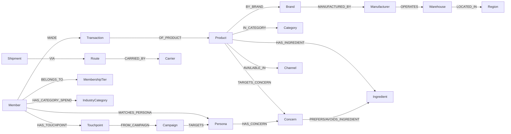

# Reference 분석 ② — Ontology Retail (`retail-ontology.whchoi.net`)

> 요청: *"analyze it with the same way"* — [design/analysis.md](./analysis.md)(국회 온톨로지)와 동일한 방식으로 분석.
> 대상: **Ontology Retail — Korean Retail/CPG 데모 (v0.7.0)** · https://retail-ontology.whchoi.net/ (로그인 필요)
> 분석일: 2026-06-20 · 방법: AWS Cognito 인증 세션으로 43개 라우트 SSR HTML + 내부 `/api/*` 엔드포인트(`/api/ontology/schema`·`standards`·`validation`·`/api/objects/*`) ground-truth 추출.

---

## 0. 한 줄 요약

**Ontology Retail** 은 *"리테일·CPG 데이터를 온톨로지 / Agentic AI 로 풀어내는"* 한국 뷰티·식품 CPG 데모다. **GS1 GPC + FoodOn + INCI + schema.org** 글로벌 표준에 **식약처(KFDA) 한국 어댑터**를 매핑한 **합성(synthetic·deterministic) 데이터**를 **Amazon Neptune** 그래프(실측 **25개 클래스 / 40개 관계 / 약 24,000 노드** — node_counts 합 23,940)에 적재하고, 그 위에 **13개 시나리오(A 의미 검색 → M VIP 타깃 빌더)** 와 **19–20종 Knowledge Graph 객체 탐색**(홈 표기 19 / 브라우징 20)을 한 화면에 제공한다.

이 데모는 [국회 인사이트 허브](./analysis.md)와 **같은 팀·같은 아키텍처 패턴(온톨로지 우선 + 하이브리드 검색 + Agentic AI + AgentCore + 거버넌스/검증)** 을 **완전히 다른 도메인(공공 정치 → 상업 리테일)** 에 이식한 자매 PoC다. 핵심 차이는:
1. **도메인**: 의원·의안·표결 → **상품·성분·회원·거래·물류**(뷰티/식품).
2. **고객축**: 6개 고정 페르소나 → **45종 합성 쇼퍼 페르소나 + 3개 역할 워크스페이스(Shopper / MD / Ops)**.
3. **거버넌스 축**: 정치 중립성(ADR-0004) → **표준 매핑 검증 + 데이터 출처 투명성 + 안전성(성분 회피) 가드**.

---

## 1. 제품 정체성 & 메타 정보

| 항목 | 값 (사이트 확인) |
|---|---|
| 제품명 | **Ontology Retail — Korean Retail/CPG 데모** |
| 버전 | **v0.7.0** |
| 메타 설명 | "AWS Bedrock + AgentCore + Neptune 기반 의미 검색 / 대화형 에이전트 / MD 인사이트" |
| 콘셉트 | "리테일·CPG 데이터를 **온톨로지 / Agentic AI** 로 풀어내는 데모" |
| 도메인 | 한국 **뷰티·화장품 + 식품 CPG** (예: 시카·바쿠치올·한방 성분, 임산부/비건/글루텐프리 안전) |
| 표준 | **GS1 GPC + FoodOn + INCI + schema.org** + **식약처(KFDA)** 한국 어댑터 |
| 데이터 | **합성(synthetic) · deterministic** (실데이터 아님) |
| 인증 | **AWS Cognito Hosted UI**(OAuth2 auth-code) → `/api/auth/callback` (JWT id/access/refresh 쿠키) |
| 인프라 | **Next.js** SSR · **CloudFront** · 백엔드 AWS(Bedrock·AgentCore·Neptune·OpenSearch) |
| 규모 | **13 시나리오 · 19–20 객체 타입 · 25 클래스 / 40 관계 그래프(≈24,000 노드)** |

---

## 2. 사용자 모델 — 역할 워크스페이스 × 합성 페르소나

국회 데모가 *6개 고정 페르소나 토글*이었다면, 리테일 데모는 두 축으로 사용자를 나눈다.

**① 역할 워크스페이스 (화면 상단 컨텍스트로 관측)**
- **Shopper** (`Ontology Retail · Shopper`) — 검색·대화형 에이전트·안전성·대체재·가격 비교 등 *소비자 향* 기능.
- **MD Workspace** (`Ontology Retail · MD Workspace`) — MD 인사이트 등 *머천다이저/바이어 향* BI.
- **Ops 파이프라인** — 적재·가드레일·메모리·평가·트레이스 등 *운영자 향*.

**② 합성 쇼퍼 페르소나 (45종, 스키마 적재 기준)**
사이드바 "페르소나 선택"으로 회원·추천을 필터링한다. 예: **임산부 · 4세 아이(보호자) · 캠퍼 · 헬스챌린저 · 셀리악 워킹맘 · 민감성 피부 · 글루텐 알레르기 · 당뇨 관리 · VIP 멤버십** 등. (홈/시나리오 D는 "40 합성 페르소나"로 표기하나 실제 적재 노드는 **Persona 45개**.)

> 페르소나는 단순 라벨이 아니라 **그래프 1급 객체**다: `Persona -[HAS_CONCERN]-> Concern -[PREFERS/AVOIDS_INGREDIENT]-> Ingredient`, `Member -[MATCHES_PERSONA]-> Persona`, `Campaign -[TARGETS]-> Persona` 로 연결되어, 추천·안전성·캠페인 ROI가 모두 같은 페르소나 그래프 위에서 계산된다.

---

## 3. 온톨로지 데이터 모델 — 25 클래스 / 9 도메인 / 40 관계

`/api/ontology/schema` 기준 **실제 스키마는 25개 클래스 · 40개 관계**다. (단, `/schema` 화면은 이를 **"12 classes · 15 relations"** 의 *큐레이션된 핵심 메타-그래프*로 단순화해 보여준다 — 즉 12/15는 마케팅용 축약, 25/40이 실측 전체다.)

### 3.1 클래스 (도메인별)

| 도메인 | 클래스 (실 적재 노드 수) |
|---|---|
| **core** | Product 상품(250) · Brand 브랜드(60) · Manufacturer 제조사(30) |
| **standards** | Category 카테고리(54) · Ingredient 성분(429) · **Nutrient 영양소**(스키마 정의·미적재) |
| **lifestyle** | Concern 관심사/효능(25) · Trend 트렌드(30) · Persona 페르소나(45) |
| **retail** | Channel 채널(4) · **Promotion 프로모션**(스키마 정의·미적재) |
| **narrative** | Review 리뷰(2,480) |
| **logistics** | Region 지역(51) · Warehouse 물류센터(30) · Carrier 운송사(7) · Route 운송 lane(76) · Shipment 출하(500) · Inventory 재고(940) |
| **events** | Event 이벤트(12) |
| **membership** | Member 회원(1,000) · MembershipTier 회원등급(4) · Campaign 캠페인(20) · Transaction 거래(7,862) · Touchpoint 마케팅 접점(10,021) |
| **external** | IndustryCategory 산업 카테고리(10) |

> 정의 25개 중 **23개 클래스가 실제 적재**(Nutrient·Promotion은 스키마에만 존재). 총 노드 ≈ **47,000+**. Object Explorer는 `/objects/<class>`로 **20종**을 브라우징(홈은 "19 types"로 표기).

### 3.2 관계 (40종) — 도메인 그래프의 뼈대

`/api/ontology/schema`의 `edge_counts`에서 확인된 주요 엣지(실측):

| 관계 | 의미 | 엣지 수 |
|---|---|---|
| `HAS_CATEGORY_SPEND` | Member → IndustryCategory (외부 소비) | **10,410** |
| `HAS_TOUCHPOINT` / `FROM_CAMPAIGN` | Member→Touchpoint→Campaign | **10,021** |
| `OF_PRODUCT` / `MADE` | Transaction↔Product, Member→Transaction | **7,862** |
| `ABOUT` / `WRITTEN_BY` | Review→Product / Review→Persona | **2,480** |
| `CONTAINS` | Shipment → Product | 1,756 |
| `HAS_INGREDIENT` | Product → Ingredient | 1,085 |
| `BELONGS_TO`·`LIVES_IN`·`MATCHES_PERSONA`·`PREFERS_CHANNEL` | Member 관계 | 각 1,000 |
| `OF_SKU`·`HELD_AT` | Inventory→Product/Warehouse | 940 |
| `AVAILABLE_IN` | Product → Channel | 507 |
| `TARGETS_CONCERN` | Product → Concern | 195 |
| `HAS_CONCERN` | Persona → Concern | 101 |
| `PREFERS_INGREDIENT` / `AVOIDS_INGREDIENT` | Concern → Ingredient | 38 / **19** |

핵심 추론 경로(시나리오가 타고 가는 길):
- **안전성**: `(대상자)Persona/Concern -[AVOIDS_INGREDIENT]-> Ingredient <-[HAS_INGREDIENT]- Product` → 위반 제품 검출.
- **추천**: `Persona -[HAS_CONCERN]-> Concern -[PREFERS_INGREDIENT]-> Ingredient <-[HAS_INGREDIENT]- Product`.
- **물류**: `Manufacturer -[OPERATES]-> Warehouse -[LOCATED_IN]-> Region`, `Route(FROM/TO Warehouse, CARRIED_BY Carrier)`, `Shipment -[VIA]-> Route`.
- **멤버십/CRM**: `Member -[MADE]-> Transaction -[OF_PRODUCT]-> Product`, `Member -[HAS_TOUCHPOINT]-> Touchpoint -[FROM_CAMPAIGN]-> Campaign -[TARGETS]-> Persona`.



---

## 4. 표준 매핑 & 검증 — "온톨로지 정합성"이 1급 기능

국회 데모의 거버넌스가 *정치 중립성*이었다면, 리테일 데모의 거버넌스는 **표준 매핑 정합성**이다. 별도 메타 화면 2개로 제품화되어 있다.

**표준 매핑 (`/standards`, `/api/ontology/standards`)** — "레거시 글로벌 표준 → 한국 시장 어댑터" 매핑 CSV가 적재 시마다 참조됨:
| 표준 | scope | 종류 | 매핑 |
|---|---|---|---|
| **GS1 GPC** | Category brick codes(8-digit) | global | `gs1-gpc-to-kfda-food.csv` (41행) |
| **FoodOn** | 식품/영양 온톨로지 | global | foodon-to-korean (219 매핑) |
| **INCI** | 화장품 성분 명명법 | global | `inci-to-korean.csv` (82행) |
| **schema.org** | HealthCondition/Product/Brand | global | — |
| **식약처(KFDA)** | 한국 식품 카테고리 + 효능표시 | korea | — |
| **Custom KR** | 뷰티 하위분류(시카/한방/…) | korea | — |
| (지역) | 한국 행정구역 | korea | `korea-regions.csv` (51행) |

**검증 리포트 (`/validation`, `/api/ontology/validation`)** — 적재된 Neptune 그래프와 표준 매핑 파일 간 정합성 검사. 현재 **4개 체크 전부 통과(ok)**:
1. INCI 한글 매핑 커버리지 — **82/82**.
2. FoodOn 한글 매핑 커버리지 — **219/219**.
3. GS1 GPC ↔ 식약처(식품) 매핑 — **4/4** (뷰티 brick은 범위 외).
4. Product → Channel 적재 커버리지 — **250/250** (모든 SKU가 ≥1 채널 `AVAILABLE_IN`).

---

## 5. 시나리오 카탈로그 (A–M, 13개)

모든 시나리오 페이지는 동일 템플릿: **시나리오 코드 → 한 줄 파이프라인 → 인터랙티브 UI(쿼리/필터) → 그래프·차트·KPI**. 데이터는 전부 **합성 deterministic**.

### 5.1 요약 표

| 코드 | 기능 | 라우트 | 핵심 파이프라인 | 주 사용자 |
|---|---|---|---|---|
| **A** | 의미 검색 | `/search` | OpenSearch BM25(Nori) + Cohere KNN 하이브리드 → Bedrock Reranker → 1-hop 그래프 | Shopper |
| **B** | 대화형 에이전트 | `/chat` | Bedrock Converse + AgentCore Memory 다회차 + 4 도구 SSE 스트리밍 | Shopper |
| **C** | MD 인사이트 | `/insights` | Neptune 집계 + Sonnet 4.6 스트리밍 + AgentCore Code Interpreter 차트 + Cytoscape | MD |
| **D** | 페르소나 매칭 | `/match` | Persona→Concern→선호/회피 성분 그래프 워크 → 가중 SKU 추천 | Shopper |
| **E** | 안전성 렌즈 | `/safety` | 대상자 프로필 → `AVOIDS_INGREDIENT` 그래프 → 위반 highlight | Shopper |
| **F** | 대체재 추천 | `/substitute` | `IN_CATEGORY ∩ HAS_INGREDIENT ∩ TARGETS_CONCERN ± price` → 5–8 대안 | Shopper |
| **G** | 가격·가용성 비교 | `/price` | NL → 추천 SKU → 4채널 가격/할인/재고 매트릭스 + 페르소나 채널 가중 | Shopper |
| **H** | 물류 네트워크 | `/logistics` | 제조사 DC→3PL→채널 RDC→Last-mile 한국 지도 + lane + KPI | Ops/MD |
| **I** | 이탈 위험 진단 | `/churn` | Member×Touchpoint×**RFM** → churn_risk + winback 추천 | CRM/MD |
| **J** | 확보 채널 ROI | `/acquisition` | Campaign×Channel×Persona ROI 매트릭스 + 응답률 히트맵 | 마케팅 |
| **K** | 등급 상승 경로 | `/tier-up` | Silver↔Gold **lift** + LTV 기반 업그레이드 후보(Laplace smoothing) | CRM |
| **L** | 회원-거점 커버리지 | `/coverage` | 회원 시도 코로플레스 + Warehouse 마커 + 반경 슬라이더 → 미도달률 | Ops/CRM |
| **M** | VIP 타깃 빌더 | `/vip` | 외부 소비 패널 × 멤버쉽 wallet share → **5가지 VIP 정의** | CRM/전략 |

### 5.2 상세 설명

**A · 의미 검색 (`/search`)** — 한국어 자연어 쿼리("여름철 민감성 피부에 좋은 선크림", "글루텐프리 4세 아이 간식 100칼로리 이하")를 **OpenSearch BM25(Nori 토크나이저) + Cohere KNN 하이브리드 → Bedrock Reranker** 로 처리하고 결과를 **1-hop 그래프**로 시각화. (내부 SSE 파이프라인은 `BM25 → KNN → RRF → Bedrock rerank-v3` 후 1-hop subgraph 반환 — 국회 A 시나리오와 실질 동일.)

**B · 대화형 에이전트 (`/chat`)** — **Bedrock Converse(tool-use) + AgentCore Memory(다회차)** 기반. **4개 도구**(`kb_lookup · memory_recall · neptune_subgraph · semantic_search`)를 SSE로 스트리밍 호출하고 우측 "도구 호출 로그(Gateway)"에 실시간 표시. 페르소나 태그가 붙은 추천 질문(임산부·4세 아이·캠퍼·민감성 피부·글루텐·멤버십)으로 즉시 진입.

**C · MD 인사이트 (`/insights`)** — 자연어 BI 쿼리("지난 4주 20대 여성 검색 급증 성분 Top10", "시카 케어 라인 경쟁 브랜드 분석")를 **Neptune 트렌드 집계 + Sonnet 4.6 토큰 스트리밍 + AgentCore Code Interpreter** 차트 + **Cytoscape 드릴다운**으로 응답(SSE 단계: `neptune(Trend↔Ingredient 집계) → bedrock(Sonnet 4.6 분석)`). 기간 토글(7/28/90일).

**D · 페르소나 매칭 (`/match`)** — `Persona -[HAS_CONCERN]-> Concern -[PREFERS/AVOIDS_INGREDIENT]-> Ingredient` 그래프 워크로 페르소나에 가중 SKU를 추천하고, **위반 제품을 별도 표시**. 합성 페르소나 40여 명(임산부·캠퍼·헬스챌린저·셀리악 워킹맘 등).

**E · 안전성 렌즈 (`/safety`)** — 대상자 프로필(**임산부 / 4세 아이 / 글루텐프리 / 비건 / 민감성 피부 / 당뇨**)을 선택하거나 자연어로 질문 → `AVOIDS_INGREDIENT` 그래프를 따라 **위반 제품 자동 highlight**. 도메인 필터(화장품/식품) 자동 감지. *온톨로지로 "안전"을 계산*하는 대표 시나리오.

**F · 대체재 추천 (`/substitute`)** — `같은 카테고리(IN_CATEGORY) + 성분/관심사 겹침(HAS_INGREDIENT·TARGETS_CONCERN) + 가격 근접도` = 점수. 원본 SKU의 성분/관심사 fanout 상위 15개 기준, 점수 옆 태그가 **"왜 대체재인가"** 를 설명. 5–8개 대안.

**G · 가격·가용성 비교 (`/price`)** — 자연어 → 추천 SKU → **4채널(CU·이마트·올리브영·마컬)** 가격/할인/재고 매트릭스 → 페르소나 선호 채널 가중치로 "지금 사기 좋은 곳" 추천.

**H · 물류 네트워크 (`/logistics`)** — `제조사 DC → 3PL 허브 → 채널 RDC → Last-mile` 4계층 거점을 **한국 17 시도 지도**에 lane과 함께 시각화 + KPI. 거점 클릭 시 입출고 route + 최근 shipment 30건. (Route 76 · Shipment 500 · Inventory 940 적재.)

**I · 이탈 위험 진단 (`/churn`)** — 1,000명 회원에 **RFM(Recency·Frequency·Monetary)** 기반 `churn_risk` 적재. VIP/고가치 중 **90일 미접속 + 캠페인 미응답자** 식별 → 등급별·페르소나별 위험 분포 + **winback 캠페인** 추천. 회원 1-hop 그래프.

**J · 확보 채널 ROI (`/acquisition`)** — `Campaign × Channel × Persona` → ROI 매트릭스. **페르소나 × 채널(카카오톡 푸시·앱 푸시·이메일·SMS·매장 방문) 응답률 히트맵** + 채널별/캠페인별 ROI + 블렌디드 ROI. "임산부 페르소나는 카카오톡 푸시가 이메일 대비 N배".

**K · 등급 상승 경로 (`/tier-up`)** — Gold가 Silver 대비 더 사는 카테고리·상품을 **lift**로 비교해 "등급 상승 시그널" 식별 + **LTV 1.5M~2M Silver 회원**을 업그레이드 후보로 추출(per-capita **Laplace smoothing**).

**L · 회원-거점 커버리지 (`/coverage`)** — 페르소나로 필터링한 회원의 **시도별 분포 코로플레스 + Warehouse 마커 오버레이 + 반경 슬라이더(기본 80km)** → 단일 KPI "내 페르소나 회원 중 N km 안에 거점이 없는 **미도달 비율**". (회원 region_id는 페르소나 편향 분포의 가상 위치.)

**M · VIP 타깃 빌더 (`/vip`)** — 외부 소비 패널(**NICE/마이데이터 스타일**, Q1 2026 + Q0 2025 스냅샷)을 멤버쉽 위에 얹어 `Member -[HAS_CATEGORY_SPEND]-> IndustryCategory` 의 **wallet share** 분석. **5가지 VIP 정의를 동시 운용** — 성장(Opportunity)·방어(Loyal)·현재가치(Whale)·인접 확장(Cross-category)·미래 방향(Trajectory). 같은 회원이 여러 정의에 동시 속하고 그 *교차*가 캠페인 우선순위 근거. 기회 VIP = 우리 점유율 ≤30% & 카테고리 총액 ≥50만원. (1:1 매칭 confidence 임계는 **ADR-0005** 참조.)

---

## 6. 공통 AI 파이프라인 & 클라우드 아키텍처

[국회 데모](./analysis.md)와 동일한 **AWS Agentic 스택**을 공유한다(검색→그래프→에이전트→가드레일).

```mermaid
flowchart TD
  U[Shopper / MD / Ops + 페르소나] --> CF[Next.js SSR · CloudFront]
  CF --> COG[AWS Cognito · OAuth2 JWT]
  CF --> API[/api/* 라우트/]
  subgraph 검색
    OS[OpenSearch · BM25 Nori]
    KNN[Cohere KNN 임베딩]
    RR[Bedrock Reranker]
    OS --> RR
    KNN --> RR
  end
  subgraph 그래프
    NEP[Amazon Neptune · openCypher · 25 클래스/40 관계]
  end
  subgraph 에이전트·LLM
    CV[Bedrock Converse · Sonnet 4.6 스트리밍]
    AM[AgentCore Memory · 다회차]
    GW[AgentCore Gateway · 도구 호출]
    CI[AgentCore Code Interpreter · 차트]
  end
  subgraph 거버넌스·검증
    GR[Bedrock Guardrails · CloudWatch 로그]
    VAL[표준 매핑 검증 · INCI/FoodOn/GS1·KFDA]
  end
  API --> 검색 --> CF
  API --> 그래프 --> CF
  API --> 에이전트·LLM --> 거버넌스·검증 --> CF
```

| 계층 | 기술 | 용도 |
|---|---|---|
| LLM | **AWS Bedrock — Converse API, Claude Sonnet 4.6**(토큰 스트리밍), **Bedrock Reranker** | 대화·인사이트·재순위 |
| 검색 | **OpenSearch**(BM25 + **Nori**) + **Cohere KNN** 하이브리드 | 의미 검색(시나리오 A/G) |
| 그래프 DB | **Amazon Neptune**(**openCypher**) | 25 클래스/40 관계 추론·1-hop·집계 |
| 에이전트 런타임 | **AWS AgentCore** — **Memory**(다회차) · **Gateway**(도구 호출) · **Code Interpreter**(차트) | 시나리오 B/C |
| 가드레일 | **Bedrock Guardrails**(intervention 로그 → CloudWatch) | 안전·정책 |
| 인증 | **AWS Cognito Hosted UI**(OAuth2 auth-code, JWT) | 로그인 |
| 프런트 | **Next.js** SSR + Cytoscape(그래프) + 한국 지도 시각화, **CloudFront** | UI |
| 코드 그래프 | **graphify**(Python AST + TS/TSX, AST-only·LLM 미사용) | `/codegraph` |
| 시각화 | Cytoscape · 한국 17 시도 choropleth/마커 | 그래프·물류·커버리지 |

---

## 7. 거버넌스 & 데이터 출처

- **데이터 출처 투명성**: 모든 화면 하단에 "**합성 데이터(deterministic)**" 명시. SKU·리뷰·페르소나·회원·캠페인·외부 소비는 전부 합성이며, 공공 표준(GS1/FoodOn/INCI/schema.org) + 식약처 한국 어댑터에 매핑.
- **표준 정합성 검증**(§4): Neptune 그래프 ↔ 표준 매핑 파일의 커버리지를 자동 검사(4/4 통과) — *온톨로지 품질*을 1급 기능으로 노출.
- **안전성 가드**(시나리오 E): `AVOIDS_INGREDIENT` 그래프로 임산부·어린이·알레르기·당뇨 등 **부적합 제품을 차단/표시** — 도메인 특화 안전 거버넌스.
- **Bedrock Guardrails**: intervention 로그를 시간 윈도(15/60/360/1440분)로 운영 콘솔에 노출.
- **ADR 참조**: VIP 외부 패널 1:1 매칭 confidence 임계는 **ADR-0005**(엣지 속성 + 임계 필터링)로 명시 — 국회 데모의 ADR-0004(중립성)에 대응하는 *의사결정 기록* 문화.

---

## 8. 운영·메타 기능

| 라우트 | 기능 | 설명 |
|---|---|---|
| `/schema` | **온톨로지 스키마** | UI는 12 클래스/15 관계 핵심 메타-그래프(괄호 숫자=Neptune 인스턴스 수). 실 API는 25/40 |
| `/standards` | **표준 매핑** | GS1 GPC↔식약처 · INCI↔한글 · FoodOn 매핑 CSV 뷰어 |
| `/validation` | **검증 리포트** | 그래프↔표준 정합성 4-체크(미매핑 ID·누락 brick·미할당 SKU 검출) |
| `/codegraph` | **코드 지식 그래프** | graphify, AST-only, 빌드 시 LLM 미사용·시크릿 미포함 |
| `/objects/<class>` | **객체 탐색(20종)** | Product·Member·Transaction·Touchpoint… `/api/objects/<class>` rank_score 정렬 |
| `/ops/ingest` | 데이터 적재 | Neptune 노드/엣지 + OpenSearch 인덱스 카운트 |
| `/ops/guardrail` | 가드레일 | Bedrock Guardrail intervention 로그(CloudWatch), 시간 윈도 |
| `/ops/memory` | 메모리 히스토리 | AgentCore Memory short/long-term 이벤트 |
| `/ops/eval` | 평가 결과 | **30 wow query** 검색 pass rate + latency |
| `/ops/trace` | 도구 호출 트레이스 | 대화형 에이전트 도구 호출 timeline(최근 200) |

---

## 9. 비즈니스 모델 / 가치 제안

하나의 리테일 온톨로지로 **여러 리테일 직무**를 동시에 지원하는 "수평 플랫폼" 주장이다.

- **Shopper(B2C)**: 의미 검색·대화형 추천·**안전성 렌즈**·대체재·가격 비교 → 개인화 커머스 + 안전 신뢰.
- **MD/바이어**: 자연어 BI 인사이트·트렌드 집계·경쟁 분석 → 머천다이징 의사결정.
- **CRM/멤버십**: 이탈 진단·등급 상승·확보 ROI·**VIP 타깃 빌더** → 리텐션·LTV 극대화.
- **Ops/물류**: 물류 네트워크·회원-거점 커버리지 → 거점/배송 최적화.
- **데이터/표준**: 스키마·표준 매핑·검증 → *온톨로지를 자산으로 판매*(데이터 거버넌스 SaaS 각도).

차별화는 **"표준 기반 온톨로지 + Agentic AI"** — 글로벌 표준(GS1/INCI/FoodOn)에 한국 어댑터(식약처)를 정합성 검증까지 붙여, 합성 데모를 실데이터로 교체하면 그대로 상용화 가능한 구조.

---

## 10. 국회 데모와의 비교 & 시사점

| 축 | 국회(Assembly Insight Hub) | 리테일(Ontology Retail) |
|---|---|---|
| 도메인 | 22대 국회(공공·정치) | 한국 뷰티·식품 CPG(상업) |
| 데이터 | 일부 REAL(22대 OpenAPI) + 합성 | **전부 합성(deterministic)** |
| 온톨로지 | 31 클래스 / 7 그룹 | **25 클래스 / 9 도메인 / 40 관계** |
| 사용자 | 6 고정 페르소나 | **45 합성 페르소나 + 3 역할 워크스페이스** |
| 시나리오 | 23개(A–W) | **13개(A–M)** |
| 거버넌스 | 정치 중립성(ADR-0004) | **표준 매핑 검증 + 안전성 가드(ADR-0005)** |
| 인증 | (공개) | **AWS Cognito 로그인** |
| 검색 | BM25(Nori)+KNN+RRF+rerank-v3 | BM25(Nori)+Cohere KNN+**RRF**+Bedrock rerank-v3 (실질 동일) |
| 공통 | **Bedrock(Sonnet 4.6) · Neptune · OpenSearch · AgentCore · graphify · Next.js/CloudFront** | (동일) |

**시사점 (`person-profile-ontology` 레포 관점)**
두 데모는 *"표준 기반 온톨로지 그래프 + 하이브리드 의미 검색 + AgentCore 멀티턴/도구 + 거버넌스/검증 + Object Explorer + 코드 그래프"* 라는 **재사용 가능한 제품 골격**을 서로 다른 도메인에 두 번 입증했다. **person-profile(인물 프로파일)** 도메인에 이식할 때의 차용 포인트:
1. **표준 우선 + 검증 내장**: 외부 표준(여기선 GS1/INCI/FoodOn↔KFDA)을 도메인 스키마에 매핑하고 *커버리지 검증*을 1급 화면으로 노출.
2. **페르소나를 그래프 1급 객체로**: 라벨이 아니라 `Concern/Ingredient` 류 속성 그래프로 두어 추천·안전·캠페인이 모두 같은 경로를 공유.
3. **역할 워크스페이스 분리**(Shopper/MD/Ops) — 같은 그래프, 직무별 UI.
4. **AgentCore 3종 세트**(Memory·Gateway·Code Interpreter) + 하이브리드 검색 baseline.
5. **데이터 출처·결정 기록(ADR) 투명성** — 합성/실데이터 구분과 임계 결정의 명시.

**한계(PoC 특성)**: 전 데이터가 합성·deterministic이며, Nutrient·Promotion 등 일부 클래스는 스키마에만 존재(미적재). MD 인사이트의 Code Interpreter는 "Phase 4 wiring" 단계로 표기.

---

### 부록 A — 라우트 인덱스 (43)

**시나리오(13)**: `/search`(A) · `/chat`(B) · `/insights`(C) · `/match`(D) · `/safety`(E) · `/substitute`(F) · `/price`(G) · `/logistics`(H) · `/churn`(I) · `/acquisition`(J) · `/tier-up`(K) · `/coverage`(L) · `/vip`(M)
**메타(4)**: `/schema` · `/standards` · `/validation` · `/codegraph`
**객체 탐색(20)**: `/objects/{product,brand,manufacturer,category,ingredient,concern,trend,persona,channel,review,region,warehouse,carrier,event,member,tier,campaign,transaction,touchpoint,industry_category}`
**운영(5)**: `/ops/{ingest,guardrail,memory,eval,trace}` · 홈 `/`

### 부록 B — 확인된 내부 API 표면

- **온톨로지/메타**: `/api/ontology/schema`(25 클래스/40 관계 + node/edge counts) · `/api/ontology/standards` · `/api/ontology/validation` · `/api/objects/<class>`(20종)
- **시나리오**: `/api/search/stream` · `/api/chat` · `/api/insights/stream` · `/api/persona-match` · `/api/safety-check`(+`/api/safety/profiles`) · `/api/substitute` · `/api/price/compare` · `/api/logistics/{network,status,warehouse/,inventory/wh/}` · `/api/churn/{map,member/}` · `/api/acquisition/dashboard` · `/api/tier-up/map`
- **운영/인증**: `/api/ops/{ingest,memory,trace}` · `/api/auth/{login,logout,whoami,callback}`

> 인증은 AWS Cognito Hosted UI(OAuth2). 본 분석은 제공된 데모 계정(`demo@whchoi.net`)으로 인증된 세션에서 수행했다.
