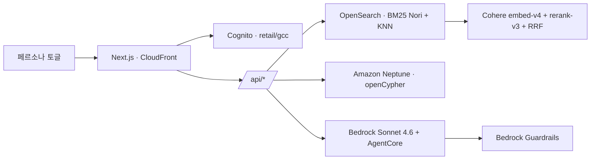

# whchoi.net 온톨로지 PoC 3종 — 통합 요약

> 세 개의 whchoi.net "온톨로지 + Agentic AI" 데모를 하나로 묶은 종합 분석.
> 상세 문서: [① Assembly](./analysis.md) · [② Retail](./retail-analysis.md) · [③ GCC](./gcc-analysis.md)
> 작성일: 2026-06-20 · 모든 수치는 라이브 사이트 SSR + `/api/*` ground-truth에서 추출 후 5-critic 워크플로로 검증.

---

## 0. 한 줄 요약

같은 메인테이너(whchoi98)가 **하나의 제품 골격**(표준 기반 온톨로지 그래프 + 하이브리드 검색 + Agentic AI + 거버넌스/검증)을 여러 도메인에 이식한 AWS 레퍼런스 데모 **가문**이다. 소스(assembly 레포 **ADR-0001**) 확인 결과 **`ontology-for-gcc`(GS칼텍스)가 아키텍처 참조 원본(맏형)** 이며, 동일 청사진으로 **retail · mfg/mfc(제조) · assembly** 를 구축했다(6-stack CDK·디렉토리·하니스 100% 동일, 도메인 클래스·페르소나·시나리오 의미만 교체). 본 문서는 그중 셋(assembly·retail·gcc)을 다루며 — *데이터를 자산에서 의사결정으로 바꾸는* 패턴을 입증한다. **GCC가 원본이자 최성숙형**(v1.0.63, ~2.1M 노드, 실 인프라 probe). *(제조 데모는 미분석.)*

---

## 1. 3종 데모 캡슐

| | **① Assembly Insight Hub** | **② Ontology Retail** | **③ Ontology GCC** |
|---|---|---|---|
| URL | `assembly.whchoi.net` | `retail-ontology.whchoi.net` | `gcc.whchoi.net` |
| 도메인 | 22대 국회(공공·정치) | 한국 뷰티·식품 CPG | **GS Caltex 정유·멤버십** |
| 정체성 | 언론사 Agentic 온톨로지 PoC | Korean Retail/CPG 데모 | GS Caltex M&M본부 데모 |
| 버전/성숙도 | PoC | v0.7.0 | **v1.0.63 (최성숙)** |
| 접근 | 공개 | **Cognito 로그인** | 공개 |
| 온톨로지 | **31 클래스 / 7 그룹** | 25 클래스 / 40 관계 (UI는 12/15) | 25 클래스 / **31 관계** |
| 데이터 규모 | 수만 엣지(실+합성) | ~24K 노드(전부 합성) | **~2.1M+ 노드** |
| 시나리오 | **23개 (A–W)** | 13개 (A–M) | 14개 (A–N) |
| 사용자 모델 | 6 고정 페르소나 | 45 합성 페르소나 + 3 워크스페이스 | **5 부서 페르소나** |
| 데이터 출처 | 일부 REAL(22대 OpenAPI)+합성 | 전부 합성(deterministic) | 실 코호트 500 + 50K 합성 + 외부 |
| 외부 표준/시그널 | (뉴스·SNS·여론조사 합성) | GS1·FoodOn·INCI·schema.org+KFDA | **Opinet·KOSTAT·KFDA·KMA·현대카드** |
| 거버넌스 초점 | 정치 중립성(ADR-0004) | 표준 매핑 검증 + 안전성(성분) | 컴플라이언스 게이트 + 적재 검증 + 인프라 probe |

---

## 2. 공통 골격 4요소 → AWS 서비스 → 비즈니스 관점

세 데모가 공유하는 동일 아키텍처. 기술 스택과 비즈니스 효익을 함께 매핑:

| 구성요소 | 핵심 서비스 | 기술적 역할 | 비즈니스 관점 — 무엇을 가능케 하나 |
|---|---|---|---|
| **① 표준 기반 온톨로지** | **Amazon Neptune** (openCypher) | 클래스·관계 적재, 1–3 hop 탐색, write-back | **흩어진 데이터를 360° 관계망으로 통합** — 단일 진실원천 |
| | 표준 매핑 레이어 | 외부·공공 표준 정합 | **규제 준수 + 외부 데이터 즉시 결합** |
| **② 하이브리드 검색** | **OpenSearch**(BM25 Nori) + **Cohere**(embed-v4 KNN · rerank-v3) + **RRF** | 키워드+의미 융합·재순위 | **자연어 셀프서비스 발견** — 직원·고객이 물으면 바로 찾음 |
| **③ Agentic AI** | **Bedrock(Claude Sonnet 4.6)** + **AgentCore**(Memory · Code Interpreter · tool-use) | 대화·요약·도구 호출·차트·시뮬 | **분석가 1명 몫 자동화** — 맞춤 인사이트·시뮬·보고서 |
| | scikit-learn / Lambda | 군집·함수형 처리 | **세그먼트·이상행동 자동 발견** |
| **④ 거버넌스·검증** | **Bedrock Guardrails** + Validation 리포트 + CloudWatch | 안전 검사·정합성·이력 | **브랜드·규제 리스크 방어 + 신뢰할 수 있는 의사결정** |

> 비즈니스 한 줄: **① 데이터 통합 → ② 누구나 찾기 → ③ AI가 분석·실행 → ④ 안심하고 신뢰**.

### 공통 클라우드 스택

공통: **Bedrock Sonnet 4.6 · Neptune · OpenSearch · Cohere · AgentCore · Bedrock Guardrails · graphify(코드 그래프) · Next.js/CloudFront**. (retail·gcc는 **Cognito** 인증, gcc는 **ECS Fargate·S3**도 boto3로 노출.)

---

## 3. 반복되는 설계 DNA (3종 공통 패턴)

1. **온톨로지 우선**: 통계 대시보드가 아니라 *관계 그래프*. 모든 시나리오가 같은 그래프에서 파생.
2. **출처를 스키마에 내장**: `source(real/synthetic/external)`(assembly·retail) / `data_depth`(gcc) 노드 속성으로 실·합성·외부를 구분.
3. **하이브리드 검색 baseline**: BM25(Nori) + Cohere KNN + RRF + rerank-v3 — 세 데모 동일.
4. **페르소나 = 표현 계층**: 하나의 사실 그래프 위에 어조·정렬·KPI를 페르소나/부서별로 재구성.
5. **AgentCore 3종**: Memory(멀티턴) · Code Interpreter(Firecracker microVM 차트) · tool-use(도구 자율 호출).
6. **거버넌스/검증을 1급 화면으로**: Guardrails + 표준 매핑/적재 검증 리포트 + Ops 콘솔.
7. **메타·운영 도구 세트**: Object Explorer · 온톨로지 스키마(ER) · **graphify 코드 지식 그래프** · Ops(적재·가드레일·메모리·평가·트레이스).

---

## 4. 도메인별 차별 포인트

- **① Assembly** — *REAL 데이터의 깊이*: 실제 22대 표결(VOTED 28,528)·공동발의(19,191) 그래프 위에 이상치·정치 여정·인물 관계 분석. PDF 시그니처 리포트. 거버넌스=정치 중립성(정파 색 미사용, `political_balance_score`).
- **② Retail** — *표준·안전 중심*: GS1/INCI/FoodOn↔KFDA 매핑 + 검증 리포트(4 체크). `AVOIDS_INGREDIENT` 그래프로 임산부·비건·알레르기 **안전성 렌즈**. 45 페르소나를 그래프 객체로. Shopper/MD/Ops 역할 분리.
- **③ GCC** — *규모·외부 시그널·운영 성숙*: ~2.1M 노드, KMA 기상·현대카드 소비지수 외부 융합, 컴플라이언스 게이트(약관 동의×Guardrails), **boto3 실시간 인프라 probe**, 5 부서 KPI 페르소나.

---

## 5. 데이터 현실성 스펙트럼

| | 실(real) | 하이브리드 | 합성(synthetic) | 외부(external) |
|---|---|---|---|---|
| Assembly | 검색·표결·여정·관계 등 9개 시나리오 | 4개 | 9개 | (뉴스·SNS 합성) |
| Retail | (전무) | — | **전부 합성·deterministic** | 표준 매핑 CSV |
| GCC | 코호트 500명 핵심 | — | 50K 룩어라이크 | **KMA·현대카드·Opinet (실 외부)** |

공통 메시지: *"합성 데모를 외부/실데이터로 교체하면 그대로 상용화"* — 모든 합성 항목에 전환 경로 명시.

---

## 6. `person-profile-ontology` 레포에의 시사점

세 데모는 인물·관계 도메인에 그대로 이식 가능한 **검증된 청사진**이다:

1. **출처 계층을 노드 속성으로**(`source`/`data_depth`) — 실/합성/외부를 스키마 레벨에서 추적·감사.
2. **페르소나/역할을 KPI 가중치 벡터로** — 같은 인물 그래프, 직무·관점별 점수·시점.
3. **하이브리드 검색 baseline**(BM25 Nori + KNN + RRF + rerank) + **1–3 hop 그래프 탐색**.
4. **AgentCore 3종**(Memory·Code Interpreter·tool-use)으로 대화형 분석·리포트 자동화.
5. **거버넌스 내장**: Guardrails(중립성/PII) + 표준 매핑/적재 검증을 1급 화면으로.
6. **컴플라이언스 게이트**(동의 매트릭스 + 가드레일)를 액션 실행 직전에 강제.

---

## 7. 핵심 수치 한눈에

| 지표 | Assembly | Retail | GCC |
|---|---|---|---|
| 클래스 | 31 | 25 (40 관계) | 25 (31 관계) |
| 시나리오 | 23 (A–W) | 13 (A–M) | 14 (A–N) |
| 페르소나 | 6 | 45 (+3 워크스페이스) | 5 부서 |
| 노드 규모 | 수만 엣지 | ~24K | ~2.1M+ |
| 대표 실측 | VOTED 28,528 · CO_PROPOSED 19,191 | Touchpoint 10,021 · Transaction 7,862 | FuelPrice 1.27M · FuelTransaction 556K |
| 검증 | ADR-0004 통과 | 4/4 체크 | 5/5 체크 |
| 인증 | 공개 | Cognito | 공개 |

> 상세: [analysis.md](./analysis.md) · [retail-analysis.md](./retail-analysis.md) · [gcc-analysis.md](./gcc-analysis.md)
